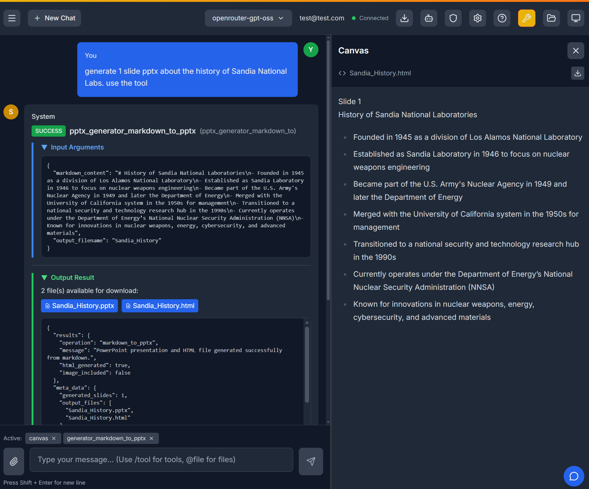

# Atlas UI 3

[](https://github.com/sandialabs/atlas-ui-3/actions/workflows/ci.yml)
[](https://github.com/sandialabs/atlas-ui-3/actions/workflows/security.yml)
[](https://github.com/sandialabs/atlas-ui-3/pkgs/container/atlas-ui-3)


Atlas UI 3 is a secure chat application with MCP (Model Context Protocol) integration, developed by Sandia National Laboratories—a U.S. Department of Energy national laboratory—to support U.S. Government customers.




## About the Project

**Atlas UI 3** is a full-stack LLM chat interface that supports multiple AI models, including those from OpenAI, Anthropic, and Google. Its core feature is the integration with the Model Context Protocol (MCP), which allows the AI assistant to connect to external tools and data sources, enabling complex, real-time workflows.

### Features

*   **Multi-LLM Support**: Connect to various LLM providers.
*   **MCP Integration**: Extend the AI's capabilities with custom tools.
*   **RAG Support**: Enhance responses with Retrieval-Augmented Generation.
*   **Secure and Configurable**: Features group-based access control, compliance levels, and a tool approval system.
*   **Modern Stack**: Built with React 19, FastAPI, and WebSockets.

## Quick Start

### Linux/macOS
```bash
bash agent_start.sh
```

### Windows
```powershell
.\ps_agent_start.ps1
```

**Note for Windows users**: If you encounter frontend build errors related to Rollup dependencies, delete `frontend/package-lock.json` and `frontend/node_modules`, then run the script again.

Both scripts automatically detect and work with Docker or Podman.

## Documentation

We have created a set of comprehensive guides to help you get the most out of Atlas UI 3.

*   **[Getting Started](./docs/getting-started/installation.md)**: The perfect starting point for all users. This guide covers how to get the application running with Docker or on your local machine.

*   **[Administrator's Guide](./docs/admin/README.md)**: For those who will deploy and manage the application. This guide details configuration, security settings, access control, and other operational topics.

*   **[Developer's Guide](./docs/developer/README.md)**: For developers who want to contribute to the project. It provides an overview of the architecture and instructions for creating new MCP servers.

## Container Images

Pre-built container images are available at `quay.io/agarlan-snl/atlas-ui-3:latest`. The CI/CD pipeline publishes updates there automatically, so it’s the recommended image for most users.

To customize a prebuilt image using a local `.env` and editable config defaults:

```bash
docker run --rm \
  --env-file ./.env \
  -v ./config/defaults:/app/config/defaults \
  -p 8000:8000 \
  quay.io/agarlan-snl/atlas-ui-3:latest
```

## For AI Agent Contributors

If you are an AI agent working on this repository, please refer to the following documents for the most current and concise guidance:

*   **[CLAUDE.md](./CLAUDE.md)**: Detailed architecture, workflows, and conventions.
*   **[GEMINI.md](./GEMINI.md)**: Gemini-specific instructions.
*   **[.github/copilot-instructions.md](./.github/copilot-instructions.md)**: A compact guide for getting productive quickly.

## License

Copyright 2025 National Technology & Engineering Solutions of Sandia, LLC (NTESS). Under the terms of Contract DE-NA0003525 with NTESS, the U.S. Government retains certain rights in this software

MIT License
