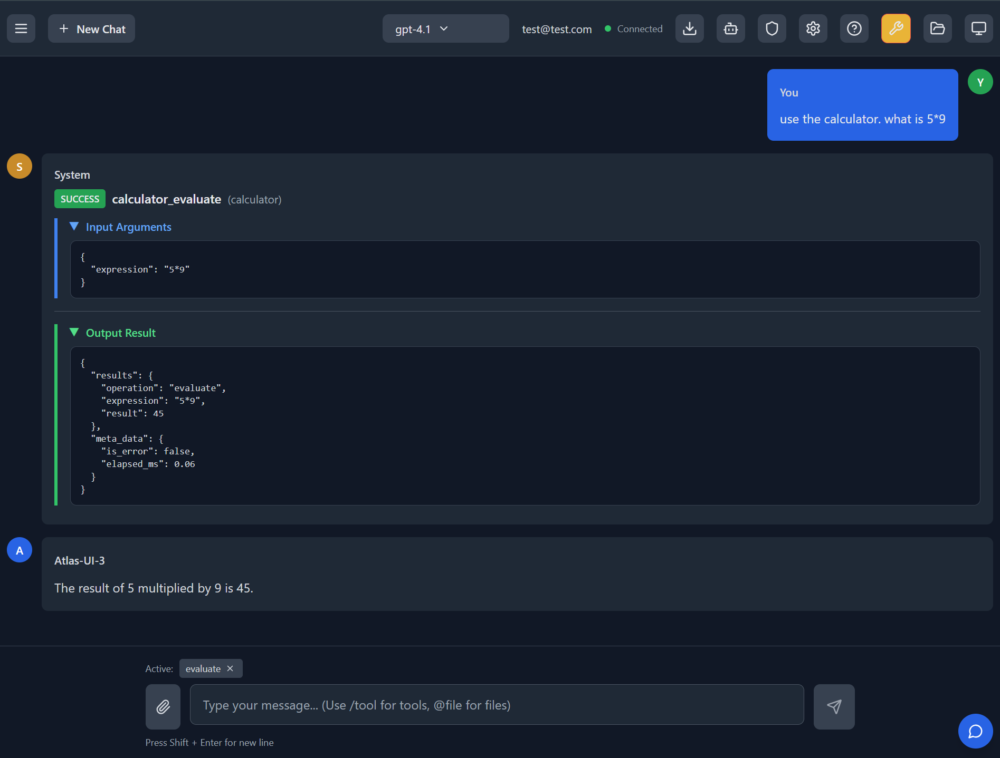

# Atlas  UI 3

A modern LLM chat interface with MCP (Model Context Protocol) integration.



# Note

This App is still under development. Not all features work well. 

## Read this first (for contributors)

For the most current, concise guidance on how to work in this repository, read:
- CLAUDE.md — architecture, workflows, and conventions verified against code
- .github/copilot-instructions.md — a compact “AI agent guide” for getting productive fast

These two docs are kept up-to-date more frequently than long-form docs. Start there before exploring the wider docs or codebase.

## Features

- **Multi-LLM Support**: OpenAI GPT, Anthropic Claude, Google Gemini
- **MCP Integration**: Connect to multiple MCP servers for tools and data sources  
- **MCP Authentication**: Secure HTTP/SSE MCP servers with API keys and custom headers (see [docs/mcp-authentication.md](docs/mcp-authentication.md))
- **Real-time Communication**: WebSocket-based chat interface
- **Custom UI**: MCP servers can modify the UI with custom HTML
- **Authorization**: Group-based access control for MCP servers
- **Modern Stack**: React frontend, FastAPI backend, Docker support

## Quick Start

### Docker (Recommended)
```bash
docker build -t atlas-ui-3 .
docker run -p 8000:8000 atlas-ui-3
```
Open http://localhost:8000

### Local Development
**Important**: This project uses **uv** as the Python package manager.

```bash
# Install uv if needed
curl -LsSf https://astral.sh/uv/install.sh | sh

# Setup environment
uv venv && source .venv/bin/activate  # Windows: .venv\Scripts\activate
uv pip install -r requirements.txt

# Configure
cp .env.example .env  # Edit with your API keys

# Build frontend
cd frontend && npm install && npm run build

# Start backend
cd ../backend && python main.py

# OR the quickest way to start is to use the agent_start.sh

bash agent_start.sh

```


## Key Technologies

- **Backend**: FastAPI + WebSockets  
- **Frontend**: React + Vite + Tailwind CSS
- **Python Package Manager**: **uv** (not pip!)
- **Configuration**: Pydantic with type safety
- **Containerization**: Docker

## Important Notes

- **Use `uv`** for Python package management, not pip or conda
- **Don't use `uvicorn --reload`** - causes problems in development
- **Use `npm run build`** instead of `npm run dev` for frontend development
- **File limit**: Maximum 400 lines per file for maintainability
- **Container Environment**: Use Fedora latest for Docker containers (GitHub Actions uses Ubuntu runners)
- **Mock S3**: The included S3 mock (`mocks/s3-mock/`) is for development/testing only and must NEVER be used in production due to lack of authentication, encryption, and other critical security features.

## License

Copyright 2025 National Technology & Engineering Solutions of Sandia, LLC (NTESS). Under the terms of Contract DE-NA0003525 with NTESS, the U.S. Government retains certain rights in this software


MIT License

