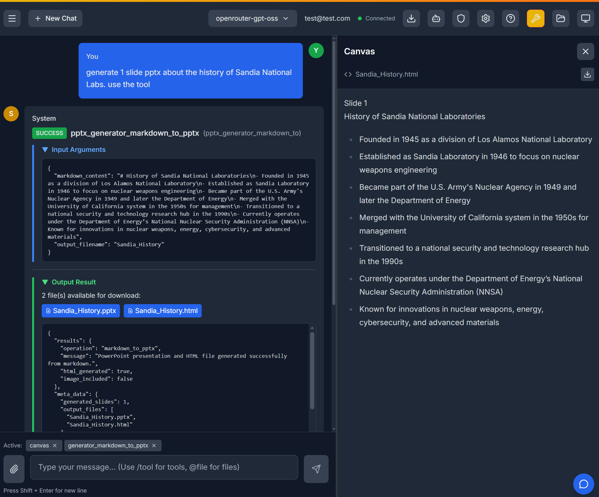

# Atlas UI 3

[](https://github.com/sandialabs/atlas-ui-3/actions/workflows/ci.yml)
[](https://github.com/sandialabs/atlas-ui-3/actions/workflows/security.yml)
[](https://github.com/sandialabs/atlas-ui-3/pkgs/container/atlas-ui-3)
[](https://badge.fury.io/py/atlas-chat)


Atlas UI 3 is a secure chat application with MCP (Model Context Protocol) integration, developed by Sandia National Laboratories -- a U.S. Department of Energy national laboratory -- to support U.S. Government customers.




## About the Project

**Atlas UI 3** is a full-stack LLM chat interface that supports multiple AI models, including those from OpenAI, Anthropic, and Google. Its core feature is the integration with the Model Context Protocol (MCP), which allows the AI assistant to connect to external tools and data sources, enabling complex, real-time workflows.

### Features

*   **Multi-LLM Support**: Connect to various LLM providers.
*   **MCP Integration**: Extend the AI's capabilities with custom tools.
*   **RAG Support**: Enhance responses with Retrieval-Augmented Generation.
*   **Secure and Configurable**: Features group-based access control, compliance levels, and a tool approval system.
*   **Modern Stack**: Built with React 19, FastAPI, and WebSockets.
*   **Python Package**: Install and use as a library or CLI tool.

## Installation

### Install from PyPI (Recommended for Users)

```bash
# Install the package
pip install atlas-chat

# Or with uv (faster)
uv pip install atlas-chat
```

### CLI Usage

After installation, three CLI tools are available:

```bash
# Set up configuration (run this first!)
atlas-init              # Creates .env and config/ in current directory
atlas-init --minimal    # Creates just a minimal .env file

# Chat with an LLM
atlas-chat "Hello, how are you?"
atlas-chat "What is 2654687621*sqrt(2)?" --tools calculator_evaluate
atlas-chat --list-tools
atlas-chat --list-models

# Start the web server
atlas-server --port 8000
atlas-server --env /path/to/.env --config-folder /path/to/config
```

### Python API Usage

```python
import asyncio
from atlas import AtlasClient

async def main():
    client = AtlasClient()

    # Simple chat
    result = await client.chat("Hello, how are you?")
    print(result.message)

    # Use the calculator MCP tool (tool_choice_required forces tool use)
    result = await client.chat(
        "What is 1234 * 5678?",
        selected_tools=["calculator_evaluate"],
        tool_choice_required=True,
    )
    print(result.message)

    await client.cleanup()

asyncio.run(main())
```

Synchronous usage:

```python
from atlas import AtlasClient

client = AtlasClient()
result = client.chat_sync("Hello!")
print(result.message)
```

## Quick Start (Development)

### Prerequisites

```bash
# Install uv package manager (one-time)
curl -LsSf https://astral.sh/uv/install.sh | sh

# Create virtual environment and install in editable mode (with dev dependencies)
uv venv && source .venv/bin/activate
uv pip install -e ".[dev]"
```

This installs the `atlas` package in **editable mode**, meaning:
- All dependencies are installed from `pyproject.toml` (the single source of truth)
- The `atlas` package is importable everywhere without needing `PYTHONPATH`
- Edit any Python file in `atlas/` and changes take effect immediately
- CLI commands (`atlas-chat`, `atlas-server`, `atlas-init`) are available
- Dev tools (pytest, ruff, podman-compose) are included

**Alternative: PYTHONPATH (if you can't use editable install)**
```bash
# Set PYTHONPATH manually when running
PYTHONPATH=/path/to/atlas-ui-3 python atlas/main.py
```

### Local Experimentation and MCP Testing

If you cloned the repo and want to run tests, experiment locally, or test MCP servers, sync the dev dependencies:

```bash
uv sync --dev
```

This installs pytest, ruff, MCP demo server dependencies (matplotlib, pandas, etc.), and other development tools into your virtual environment.

### Extract Pre-Built Frontend from PyPI Package

On a machine without Node.js, you can extract the pre-built frontend assets from the published PyPI wheel instead of running `npm run build`.

```bash
# Create a throwaway venv and install the package into it
uv venv ./tmp/atlas-extract --python 3.11
uv pip install atlas-chat --target ./tmp/atlas-extract/site

# Copy the static files into your cloned repo
cp -r ./tmp/atlas-extract/site/atlas/static/ atlas/static/

# Clean up
rm -rf ./tmp/atlas-extract
```

The server checks `atlas/static/` first, then falls back to `frontend/dist/`. Once the files are in place, `bash agent_start.sh` will serve the frontend without needing Node.js.

### Running the Application

**Linux/macOS:**
```bash
bash agent_start.sh
```

**Windows:**
```powershell
.\ps_agent_start.ps1
```

**Note for Windows users**: If you encounter frontend build errors related to Rollup dependencies, delete `frontend/package-lock.json` and `frontend/node_modules`, then run the script again.

Both scripts automatically detect and work with Docker or Podman. The `agent_start.sh` script builds the frontend, starts necessary services, and launches the backend server.

## Documentation

We have created a set of comprehensive guides to help you get the most out of Atlas UI 3.

*   **[Getting Started](./docs/getting-started/installation.md)**: The perfect starting point for all users. This guide covers how to get the application running with Docker or on your local machine.

*   **[Administrator's Guide](./docs/admin/README.md)**: For those who will deploy and manage the application. This guide details configuration, security settings, access control, and other operational topics.

*   **[Developer's Guide](./docs/developer/README.md)**: For developers who want to contribute to the project. It provides an overview of the architecture and instructions for creating new MCP servers.

## Releases

Atlas UI 3 ships on a **monthly cadence**. During the last week of each calendar month the `release-cut` workflow opens a draft release PR from a new `release/YYYY.MM` branch, bumps `atlas/version.py` and `pyproject.toml`, and finalizes the `CHANGELOG.md` section for that release. A maintainer (the release captain) runs the smoke test, pushes a `vX.Y.Z` tag, and publishes — the `release-cut` workflow itself never tags or publishes.

The full runbook — branch strategy, versioning (SemVer), stabilization window, hotfix flow, rollback — lives in **[docs/developer/release-process.md](./docs/developer/release-process.md)**. Published versions land on [PyPI](https://pypi.org/project/atlas-chat/) and as container images on Quay.io.

## Docker / Podman

### Quick Start

```bash
# 1. Set up local config (copies defaults from atlas/config/)
atlas-init
# Edit .env to add your API keys

# 2. Build the image
podman build -t atlas-ui-3 .

# 3. Run with your local config mounted
podman run -p 8000:8000 \
  -v $(pwd)/config:/app/config:Z \
  --env-file .env \
  atlas-ui-3
```

The container seeds `/app/config` from package defaults at build time. Mounting your local `config/` folder overrides those defaults, so you can customize `llmconfig.yml`, `mcp.json`, etc. without rebuilding.

### Container Images

Pre-built container images are available at `quay.io/agarlan-snl/atlas-ui-3:latest` (pushes automatically from main branch).

## For AI Agent Contributors

If you are an AI agent working on this repository, please refer to **[AGENTS.md](./AGENTS.md)** for all project conventions, architecture, and development guidance.

## Citing Atlas-UI-3

If you use Atlas-UI-3 in a publication, please cite:

> Melander, Darryl, Garland, Anthony, Lancaster, Caitlin, & Bernauer, Michael. *Atlas-UI-3*. Sandia National Laboratories (SNL-NM), Albuquerque, NM, 2025. https://doi.org/10.11578/dc.20260211.11

BibTeX:

```bibtex
@misc{atlas_ui_3,
  author = {Melander, Darryl and Garland, Anthony and Lancaster, Caitlin and Bernauer, Michael},
  title = {Atlas-UI-3},
  year = {2025},
  month = {10},
  doi = {10.11578/dc.20260211.11},
  url = {https://www.osti.gov/biblio/code-175384}
}
```

## License

Copyright 2025 National Technology & Engineering Solutions of Sandia, LLC (NTESS). Under the terms of Contract DE-NA0003525 with NTESS, the U.S. Government retains certain rights in this software

MIT License

