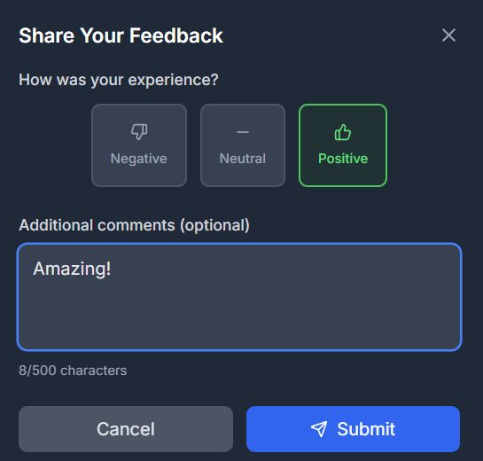
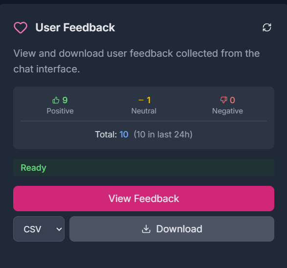

# User Feedback System

Last updated: 2026-02-08

The feedback system allows users to submit ratings and comments about their experience, which administrators can review to improve the application.

## Overview

- **Users** can submit feedback via the floating feedback button in the bottom-right corner of the interface
- **Administrators** can view, analyze, and manage feedback through the Admin Panel or API endpoints
- Feedback is stored as JSON files on the server filesystem

## User Experience

### Submitting Feedback

Users see a floating chat bubble icon in the bottom-right corner of the screen. Clicking it opens a feedback dialog where they can:



1. **Select a rating**: Positive (thumbs up), Neutral (dash), or Negative (thumbs down)
2. **Add optional comments**: Up to 500 characters describing their experience
3. **Include conversation history** (opt-in, default on): A checkbox lets users attach the full chat transcript to their feedback. When enabled, the conversation text (model name, selected tools, data sources, and all messages) is sent as a string in the `conversation_history` field
4. **Submit**: The feedback is saved along with session metadata

Session metadata captured automatically includes:
- Timestamp
- Browser user agent
- Current URL
- Screen resolution and viewport size
- Browser language and timezone

## Administrator Features

### Viewing Feedback

Administrators can access feedback through the Admin Panel by clicking "View Feedback" in the dashboard. The feedback view displays:



- **Statistics Summary**: Total count, rating distribution (positive/neutral/negative), and average rating
- **Feedback List**: Individual entries with timestamp, user, rating, and comments
- **Session Details**: Expandable technical information for each entry
- **Conversation History**: When the user opted in, the full chat transcript is shown in an expandable details section. Admins can also download the conversation history as part of the JSON export

### API Endpoints

All feedback viewing endpoints require admin group membership.

#### `GET /api/feedback`

Returns paginated list of all feedback with statistics.

**Query Parameters:**
- `limit` (int, default: 50) - Maximum entries to return
- `offset` (int, default: 0) - Pagination offset

**Response:**
```json
{
  "feedback": [
    {
      "id": "abc12345",
      "timestamp": "2026-01-10T12:00:00",
      "user": "user@example.com",
      "rating": 1,
      "comment": "Great experience!",
      "session_info": { ... },
      "server_context": { ... },
      "conversation_history": "USER:\n...\n\nASSISTANT:\n..."
    }
  ],
  "pagination": {
    "total": 100,
    "limit": 50,
    "offset": 0,
    "has_more": true
  },
  "statistics": {
    "positive": 60,
    "neutral": 25,
    "negative": 15,
    "total": 100,
    "average": 0.45
  }
}
```

#### `GET /api/feedback/stats`

Returns feedback statistics summary without the full feedback list.

**Response:**
```json
{
  "total_feedback": 100,
  "rating_distribution": {
    "positive": 60,
    "neutral": 25,
    "negative": 15
  },
  "average_rating": 0.45,
  "recent_feedback": 5,
  "feedback_with_comments": 42,
  "unique_users": 35
}
```

#### `DELETE /api/feedback/{feedback_id}`

Deletes a specific feedback entry by ID.

**Response:**
```json
{
  "message": "Feedback deleted successfully",
  "feedback_id": "abc12345",
  "deleted_by": "admin@example.com"
}
```

#### `GET /api/feedback/download`

Downloads all feedback data as CSV or JSON file.

**Query Parameters:**
- `format` (string, default: "csv") - Download format, either "csv" or "json"

**Response:**
Returns a file download with the appropriate content type:
- CSV format: `text/csv` with filename `feedback_export_{timestamp}.csv`
- JSON format: `application/json` with filename `feedback_export_{timestamp}.json`

CSV columns: `id`, `timestamp`, `user`, `rating`, `comment` (missing fields exported as empty strings)

**Examples:**

Download as CSV:
```
GET /api/feedback/download?format=csv
```

Download as JSON:
```
GET /api/feedback/download?format=json
```

#### `POST /api/feedback`

Submits new feedback. This endpoint is available to all authenticated users (not admin-only).

**Request Body:**
```json
{
  "rating": 1,
  "comment": "Optional comment text",
  "session": {
    "timestamp": "2026-01-10T12:00:00Z",
    "userAgent": "Mozilla/5.0...",
    "url": "https://example.com/chat"
  },
  "conversation_history": "USER:\nWhat is Python?\n\nASSISTANT:\nPython is a programming language.\n"
}
```

The `conversation_history` field is optional (defaults to `null`). When provided, it is stored inline in the feedback JSON file. Maximum length is 500,000 characters. Empty or whitespace-only values are normalized to `null`.

**Rating Values:**
- `1` = Positive
- `0` = Neutral
- `-1` = Negative

## Configuration

### Storage Location

Feedback files are stored in the directory specified by:

```
RUNTIME_FEEDBACK_DIR=../runtime/feedback
```

The default path is relative to the `atlas/` directory, so `../runtime/feedback` resolves to `runtime/feedback` at the project root level.

In Docker deployments, the absolute path `/app/runtime/feedback` is used.

Each feedback entry is saved as a separate JSON file with the naming pattern:
```
feedback_{timestamp}_{id}.json
```

### Access Control

Feedback viewing requires membership in the admin group. Configure the admin group via:

```
APP_ADMIN_GROUP=admin
```

The `is_user_in_group` function in `core/auth.py` determines group membership. Customize this function to integrate with your organization's group/role system.

## Data Structure

Each feedback file contains:

```json
{
  "id": "abc12345",
  "timestamp": "2026-01-10T12:00:00.000000",
  "user": "user@example.com",
  "rating": 1,
  "comment": "User's comment text",
  "session_info": {
    "timestamp": "2026-01-10T12:00:00.000Z",
    "userAgent": "Mozilla/5.0...",
    "url": "https://example.com/chat",
    "screenResolution": "1920x1080",
    "viewportSize": "1200x800",
    "language": "en-US",
    "timezone": "America/New_York"
  },
  "server_context": {
    "user_agent": "Mozilla/5.0...",
    "client_host": "192.168.1.100",
    "forwarded_for": "",
    "referer": "https://example.com/"
  },
  "conversation_history": "Model: gpt-4o\nTools: server_toolName\nData Sources: None selected\n\n--- Conversation ---\n\nUSER:\nWhat is Python?\n\nASSISTANT:\nPython is a programming language.\n"
}
```

## Security Considerations

- Feedback submission requires authentication (user must be logged in)
- Viewing, statistics, and deletion require admin group membership
- User email addresses are captured for accountability
- Comments are trimmed and stored as-is (consider sanitization for display)
- Client IP addresses are logged in server_context for audit purposes
- Conversation history is capped at 500,000 characters to prevent resource exhaustion
