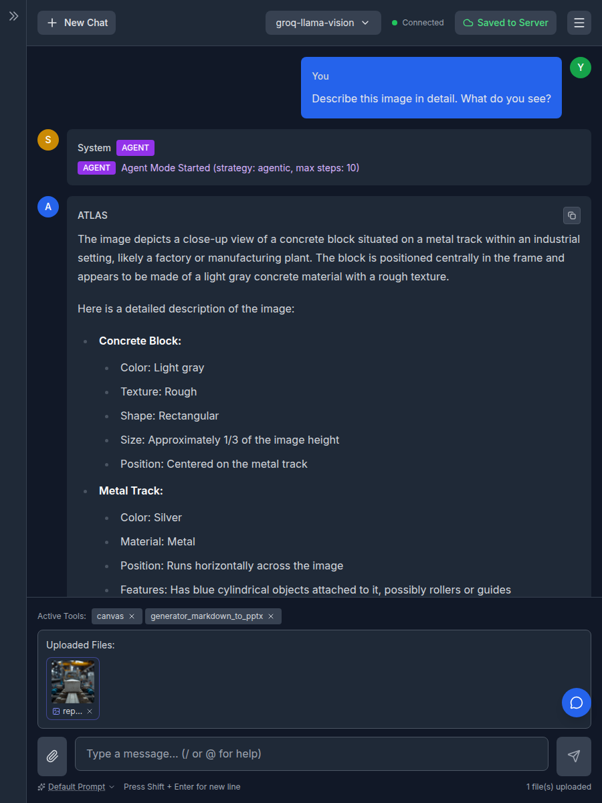

# LLM Configuration

Last updated: 2026-03-23

The `llmconfig.yml` file is where you define all the Large Language Models that the application can use. The application uses the `LiteLLM` library, which allows it to connect to a wide variety of LLM providers.

*   **Location**: The package default is at `atlas/config/llmconfig.yml`. Place your instance-specific configuration in `config/llmconfig.yml`.

## Comprehensive Example

Here is an example of a model configuration that uses all available options.

```yaml
models:
  MyCustomGPT:
    model_name: openai/gpt-4-turbo-preview
    model_url: https://api.openai.com/v1/chat/completions
    api_key: "${OPENAI_API_KEY}"
    description: "The latest and most capable model from OpenAI."
    max_tokens: 8000
    temperature: 0.7
    extra_headers:
      "x-my-custom-header": "value"
    compliance_level: "External"
    supports_vision: true

  OpenRouterLlama:
    model_name: meta-llama/llama-3-70b-instruct
    model_url: https://openrouter.ai/api/v1
    api_key: "${OPENROUTER_API_KEY}"
    description: "Llama 3 70B via OpenRouter"
    max_tokens: 4096
    temperature: 0.7
    extra_headers:
      "HTTP-Referer": "${OPENROUTER_SITE_URL}"
      "X-Title": "${OPENROUTER_SITE_NAME}"
    compliance_level: "External"
```

**Note**: The second example demonstrates environment variable expansion in `extra_headers`, which is useful for services like OpenRouter that require site identification headers.

## Environment Variable Expansion in LLM Configs

Similar to MCP server authentication, LLM configurations support environment variable expansion for API keys and header values. This feature provides security and flexibility in managing sensitive credentials.

### Security Best Practice

**Never store API keys directly in configuration files.** Instead, use environment variable substitution:

```yaml
models:
  my-openai-model:
    model_name: openai/gpt-4
    model_url: https://api.openai.com/v1
    api_key: "${OPENAI_API_KEY}"
    extra_headers:
      "X-Custom-Header": "${MY_CUSTOM_HEADER_VALUE}"
```

Then set the environment variables:
```bash
export OPENAI_API_KEY="sk-your-secret-api-key"
export MY_CUSTOM_HEADER_VALUE="your-custom-value"
```

### How It Works

1. **API Key Expansion**: The `api_key` value is processed at runtime. If it contains the `${VAR_NAME}` pattern, it's replaced with the value of the environment variable `VAR_NAME`.
2. **Extra Headers Expansion**: Each value in the `extra_headers` dictionary is also processed for environment variable expansion, allowing you to use dynamic values for headers like `HTTP-Referer` or `X-Title`.
3. **Error Handling**: If a required environment variable is missing, the application will raise a clear error message indicating which variable needs to be set. This prevents silent failures where unexpanded variables might be sent to the API provider.
4. **Literal Values**: You can still use literal string values without environment variables for development or testing purposes (though not recommended for production).

### Common Use Cases

**OpenRouter Configuration:**
```yaml
models:
  openrouter-claude:
    model_name: anthropic/claude-3-opus
    model_url: https://openrouter.ai/api/v1
    api_key: "${OPENROUTER_API_KEY}"
    extra_headers:
      "HTTP-Referer": "${OPENROUTER_SITE_URL}"
      "X-Title": "${OPENROUTER_SITE_NAME}"
```

**Custom LLM Provider with Authentication Headers:**
```yaml
models:
  custom-provider:
    model_name: custom/model-name
    model_url: https://custom-llm.example.com/v1
    api_key: "${CUSTOM_PROVIDER_API_KEY}"
    extra_headers:
      "X-Tenant-ID": "${TENANT_IDENTIFIER}"
      "X-Region": "${DEPLOYMENT_REGION}"
```

### Security Considerations

- **Recommended**: Use environment variables for all production API keys and sensitive header values
- **Alternative**: For development/testing, you can use direct string values (not recommended for production)
- **Never**: Commit API keys to `atlas/config/llmconfig.yml` or any version-controlled files

This environment variable expansion system works identically to the MCP server `auth_token` field, providing consistent behavior across all authentication and configuration mechanisms in the application.

## Per-User API Keys (2026-02-08)

Models can be configured to require users to bring their own API keys instead of using system-managed environment variables. This is useful when admins want to provide curated model endpoints but let individual users supply their own credentials.

### Configuration

Add `api_key_source: "user"` to a model definition:

```yaml
models:
  # System-managed key (default behavior)
  gpt-4.1:
    model_name: gpt-4.1
    model_url: https://api.openai.com/v1/chat/completions
    api_key: "${OPENAI_API_KEY}"
    compliance_level: "External"

  # User-managed key (users must bring their own)
  user-openai:
    model_name: gpt-4.1
    model_url: https://api.openai.com/v1/chat/completions
    api_key: ""
    api_key_source: "user"
    description: "OpenAI GPT-4.1 (bring your own key)"
    compliance_level: "External"
```

### How It Works

1. When `api_key_source` is `"user"`, the model appears in the UI with a key icon
2. Users click the key icon to open a modal and paste their API key
3. The key is encrypted and stored per-user using the same `MCPTokenStorage` as MCP server tokens (with `llm:{model_name}` prefix)
4. When the user sends a chat message with that model, the stored key is used for the LLM API call
5. If no key is stored, the model is disabled in the dropdown

### API Endpoints

| Method | Path | Description |
|--------|------|-------------|
| GET | `/api/llm/auth/status` | Auth status for all user-key models |
| POST | `/api/llm/auth/{model_name}/token` | Upload API key for a model |
| DELETE | `/api/llm/auth/{model_name}/token` | Remove API key for a model |

### Values for `api_key_source`

- `"system"` (default) - API key resolved from environment variables using `${VAR_NAME}` syntax
- `"user"` - API key provided per-user via the UI, stored encrypted on disk

## Restricting Model Access by Group (2026-07-10)

By default every model is available to every user. To restrict a model to
specific groups, add an optional `groups` list to the model definition. This
uses the same `groups` access-control convention as MCP servers and RAG sources.

```yaml
models:
  # Open to everyone (default) — no `groups` line.
  gpt-4o-mini:
    model_name: gpt-4o-mini
    model_url: https://api.openai.com/v1/chat/completions
    api_key: "${OPENAI_API_KEY}"
    compliance_level: "External"

  # Restricted — only members of `research` or `admin` may see or use it.
  internal-frontier:
    model_name: openai/frontier-internal
    model_url: https://llm.internal.example.com/v1
    api_key: "${INTERNAL_LLM_API_KEY}"
    compliance_level: "Internal"
    groups:
      - research
      - admin
```

### Behavior

- **Omitted / empty `groups`**: unchanged — the model is available to all users
  (fully backward compatible).
- **Non-empty `groups`**: a user may access the model only if they are a member
  of **at least one** listed group. Group membership is resolved through the same
  `is_user_in_group` check used for MCP servers and RAG sources (external
  authorization endpoint in production, mock groups in local debug mode).

### Enforcement

Access is enforced in two places so it cannot be bypassed by a crafted request:

1. **Listing** — restricted models are filtered out of the `/api/config` and
   `/api/config/shell` responses for unauthorized users, so they never appear in
   the model dropdown.
2. **Execution** — the chat orchestrator re-checks authorization for the
   requested model on every turn before any LLM call. An unauthorized model
   request is rejected with an authorization error even if the client sends the
   model name directly over the WebSocket.

## Configuration Fields Explained

*   **`model_name`**: (string) The identifier for the model that will be sent to the LLM provider. For `LiteLLM`, you often need to prefix this with the provider name (e.g., `openai/`, `anthropic/`).
*   **`model_url`**: (string) The API endpoint for the model.
*   **`api_key`**: (string) The API key for authenticating with the model's provider. **Security Best Practice**: Use environment variable substitution with the `${VAR_NAME}` syntax (e.g., `"${OPENAI_API_KEY}"`). The application will automatically expand these variables at runtime, pass the resolved key to LiteLLM for that request, and provide clear error messages if a required variable is not set. ATLAS does not infer or overwrite provider-specific environment variables from model names, so gateways, proxies, and custom aliases should set the key/source explicitly. This works identically to the `auth_token` field in MCP server configurations. You can also use literal API key values for development/testing (not recommended for production).
*   **`description`**: (string) A short description of the model that will be shown to users in the model selection dropdown.
*   **`max_tokens`**: (integer) The maximum number of tokens to generate in a response.
*   **`temperature`**: (float) A value between 0.0 and 1.0 that controls the creativity of the model's responses. Higher values are more creative.
*   **`extra_headers`**: (dictionary) A set of custom HTTP headers to include in the request, which is useful for some proxy services or custom providers. **Environment Variable Support**: Header values can also use the `${VAR_NAME}` syntax for environment variable expansion. This is particularly useful for services like OpenRouter that require headers like `HTTP-Referer` and `X-Title`. If an environment variable is missing, the application will raise a clear error message.
*   **`api_key_source`**: (string) Controls where the API key comes from. `"system"` (default) resolves from environment variables. `"user"` requires each user to provide their own key via the UI. See [Per-User API Keys](#per-user-api-keys-2026-02-08) above.
*   **`pass_user_as_customer_id`**: (boolean, default `false`) When `true`, the logged-in user's identifier is sent as the `x-litellm-customer-id` HTTP header on each request to the model. A [LiteLLM proxy](https://docs.litellm.ai/docs/proxy/customers) uses this header to attribute spend/usage to the end user (customer). See [LiteLLM Customer ID Header](#litellm-customer-id-header) below.
*   **`customer_id_strip_suffix`**: (string, optional) An email-domain suffix (e.g. `"@mydomain.com"`) to strip from the reverse-proxy-provided username before it is sent as the `x-litellm-customer-id` header — turning `user@mydomain.com` into `user`. Only applies when `pass_user_as_customer_id` is `true` and the username actually ends with the suffix (matched case-insensitively); otherwise the value is sent unchanged. See [LiteLLM Customer ID Header](#litellm-customer-id-header) below.
*   **`supports_vision`**: (boolean, default `false`) When `true`, the model accepts image inputs. Users can upload images in the chat UI, and those images are sent as inline base64 content blocks in the user message rather than being described in the text files manifest. Only raster image formats are supported (PNG, JPEG, GIF, WebP); SVG files are excluded. See [Vision Image Support](#vision-image-support-2026-03-23) below.
*   **`compliance_level`**: (string) The security compliance level of this model (e.g., "Public", "Internal"). This is used to filter which models can be used in certain compliance contexts.
*   **`groups`**: (list of strings, optional) Access-control groups for this model. When omitted or empty (the default), the model is available to everyone. When set, only users who belong to at least one listed group can see or use the model. Enforced at both the model-listing and chat-execution layers. See [Restricting Model Access by Group](#restricting-model-access-by-group-2026-07-10) above.

## LiteLLM Customer ID Header

When ATLAS talks to a model served through a [LiteLLM proxy](https://docs.litellm.ai/docs/proxy/customers), the proxy can track spend and usage per end user ("customer"). To enable this, set `pass_user_as_customer_id: true` on the model:

```yaml
models:
  litellm-gpt-4o:
    model_url: "https://litellm.internal.example.com/v1"
    model_name: "gpt-4o"
    api_key: "${LITELLM_API_KEY}"
    compliance_level: "Internal"
    supports_tools: true
    pass_user_as_customer_id: true
```

### How It Works

1. On every request for this model, ATLAS adds the `x-litellm-customer-id` header set to the logged-in user's identifier (their email).
2. The LiteLLM proxy reads this header and attributes the request's spend/usage to that customer, upserting the customer record automatically. LiteLLM checks this header first in its customer-resolution priority order.
3. The header is combined with any other values configured in `extra_headers`; it does not replace them.
4. **Explicit `extra_headers` win.** If you set `x-litellm-customer-id` yourself under `extra_headers` (matched case-insensitively), that value is authoritative and ATLAS leaves it untouched — the logged-in user is *not* injected over it. Use this to pin a static customer id for a service account or for testing.
5. For background or system calls that have no associated user, the header is omitted (it is used for tracking, not authentication) — unless a static id is pinned via `extra_headers` as in point 4.

Only enable this for models served through a LiteLLM instance that performs per-customer tracking. Other providers ignore the header, but there is no reason to send it to them.

### Stripping a Domain Suffix

The reverse proxy in front of ATLAS often supplies the username as a full email (`user@mydomain.com`), but you may want the LiteLLM customer id to be just the local part (`user`) — for example when your LiteLLM customer records are keyed by bare usernames. Set `customer_id_strip_suffix` to the domain suffix to remove:

```yaml
models:
  litellm-gpt-4o:
    model_url: "https://litellm.internal.example.com/v1"
    model_name: "gpt-4o"
    api_key: "${LITELLM_API_KEY}"
    compliance_level: "Internal"
    pass_user_as_customer_id: true
    customer_id_strip_suffix: "@mydomain.com"
```

With this config, a request from `alice@mydomain.com` sends `x-litellm-customer-id: alice`.

Behavior notes:

- The suffix is matched case-insensitively (email domains are case-insensitive), so `@mydomain.com` also strips `@MyDomain.COM`.
- If the username does not end with the configured suffix (e.g. a user from a different domain), the full value is sent unchanged.
- Stripping applies only to the auto-injected logged-in user. A static id pinned via `extra_headers` (point 4 above) is never modified.
- Leave `customer_id_strip_suffix` unset to send the full username, which is the default.

## Vision Image Support (2026-03-23)

Models that support image/vision input can be configured with `supports_vision: true`. When enabled:

1. The chat UI shows image upload controls when the model is selected
2. Uploaded images (PNG, JPEG, GIF, WebP) are sent as inline base64 content blocks in the user message
3. Non-image files continue to appear in the text files manifest as before
4. SVG files are always excluded from vision embedding (treated as text)

### Example

```yaml
models:
  gpt-4o:
    model_name: gpt-4o
    model_url: https://api.openai.com/v1/chat/completions
    api_key: "${OPENAI_API_KEY}"
    compliance_level: "External"
    supports_vision: true

  # Text-only model — no supports_vision needed (defaults to false)
  gpt-3.5-turbo:
    model_name: gpt-3.5-turbo
    model_url: https://api.openai.com/v1/chat/completions
    api_key: "${OPENAI_API_KEY}"
    compliance_level: "External"
```

### Limits

- **Max image size**: 20 MB per image
- **Max images per message**: 10

Images exceeding these limits fall back to the standard text files manifest.

### Demo

Below is a screenshot of a vision-capable model (`groq-llama-vision`) describing an uploaded image. The image thumbnail appears in the "Uploaded Files" area with a vision indicator icon, and the model responds with a detailed description.



### Which Models Support Vision?

Common vision-capable models include GPT-4o, GPT-4.1, Claude Sonnet/Haiku, and Gemini. Check your provider's documentation to confirm vision support before enabling this flag.
