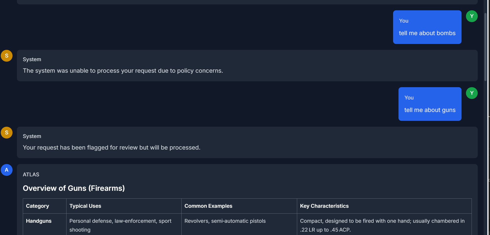

# Content Security Check

The content security check feature provides comprehensive moderation capabilities for user input, LLM-generated output, and tool/RAG outputs. This allows administrators to integrate external security APIs to validate content at multiple stages of processing.



## Overview

The security check feature consists of three independent checks:

1. **Input Security Check (Pre-check)**: Validates user input before sending it to the LLM
2. **Output Security Check (Post-check)**: Validates LLM-generated responses before showing them to users
3. **Tool/RAG Output Security Check**: Validates tool and RAG outputs before sending them to the LLM to prevent prompt injection attacks

All checks are optional and can be enabled independently via feature flags.

## Configuration

### Feature Flags

Enable the security check features in your `.env` file:

```bash
# Enable pre-check security moderation for user input
FEATURE_SECURITY_CHECK_INPUT_ENABLED=true

# Enable post-check security moderation for LLM output
FEATURE_SECURITY_CHECK_OUTPUT_ENABLED=true

# Enable security check for tool and RAG outputs before sending to LLM
FEATURE_SECURITY_CHECK_TOOL_RAG_ENABLED=true
```

### API Endpoint Configuration

Configure the external security check API:

```bash
# API endpoint URL for security checks (required if security checks are enabled)
SECURITY_CHECK_API_URL=https://security-check-api.example.com/check

# API key for authentication with security check endpoint
SECURITY_CHECK_API_KEY=your-api-key-here

# Timeout in seconds for security check API calls (default: 10)
SECURITY_CHECK_TIMEOUT=10
```

## API Contract

The security check API must accept POST requests with the following payload:

```json
{
  "content": "The user input, LLM output, or tool/RAG output to check",
  "check_type": "input" | "output" | "tool_rag_tool" | "tool_rag_rag",
  "username": "user@example.com",
  "message_history": [
    {"role": "user", "content": "Previous user message"},
    {"role": "assistant", "content": "Previous assistant message"}
  ]
}
```

**Check Types:**
- `input`: User input before sending to LLM
- `output`: LLM response before showing to user
- `tool_rag_tool`: Tool output before sending to LLM
- `tool_rag_rag`: RAG retrieval results before sending to LLM

The API must respond with one of the following statuses:

### Response Format

```json
{
  "status": "blocked" | "allowed-with-warnings" | "good",
  "message": "Optional human-readable message explaining the result",
  "details": {
    "Optional": "Additional details about the check"
  }
}
```

### Status Values

- **`blocked`**: Content violates security policies and should be rejected
- **`allowed-with-warnings`**: Content has minor issues but is acceptable (warnings shown to user)
- **`good`**: Content passes all security checks

## Behavior

### Input Check (Pre-check)

When input security checking is enabled:

1. User submits a message
2. System performs security check on user input with message history context
3. If **blocked**:
   - Message is rejected
   - User sees error message explaining why
   - Message is removed from history
   - LLM is not called
4. If **allowed-with-warnings**:
   - Warning message is shown to user
   - Processing continues normally
5. If **good**:
   - Processing continues normally

### Output Check (Post-check)

When output security checking is enabled:

1. LLM generates a response
2. System performs security check on LLM output with message history context
3. If **blocked**:
   - Response is rejected
   - User sees error message explaining why
   - Response is removed from history
4. If **allowed-with-warnings**:
   - Warning message is shown to user
   - Response is delivered to user
5. If **good**:
   - Response is delivered normally

### Tool/RAG Output Check

When tool/RAG output security checking is enabled:

1. Tool executes or RAG retrieves content
2. System performs security check on tool/RAG output before sending to LLM
3. If **blocked**:
   - Tool/RAG output is rejected
   - User sees error message explaining why
   - Request terminates without calling LLM
   - Prevents malicious prompt injection from tools/RAG sources
4. If **allowed-with-warnings**:
   - Warning message is shown to user
   - Output is sent to LLM for processing
5. If **good**:
   - Output is sent to LLM normally

**Important**: This check prevents compromised or malicious tool/RAG outputs from manipulating the LLM through prompt injection or other attacks. It's particularly important when using third-party tools or external data sources.

#### Tool Output Security

Tools can execute arbitrary code or interact with external systems. The tool output security check validates the output from tools before it's sent to the LLM. This is critical because:

- **Prompt Injection Prevention**: Malicious tools could return outputs designed to manipulate the LLM's behavior
- **Third-party Tool Safety**: When using tools from external sources, you can't always trust their outputs
- **Data Validation**: Ensures tool outputs meet your security and content policies before they influence LLM responses

**Example Scenarios:**
- A compromised file reading tool could return content containing prompt injection attacks
- A web scraping tool could return malicious content from a compromised website
- An API integration tool could return manipulated data designed to bypass security policies

#### RAG (Retrieval-Augmented Generation) Output Security

RAG systems retrieve information from external knowledge bases. The RAG output security check validates retrieved content before it's sent to the LLM:

- **Knowledge Base Integrity**: Protects against poisoned or compromised knowledge bases
- **Content Validation**: Ensures retrieved content meets security policies
- **Injection Prevention**: Prevents malicious content in RAG results from manipulating the LLM

**Example Scenarios:**
- A compromised document in the knowledge base could contain prompt injection instructions
- RAG retrieval from untrusted sources could return malicious content
- Outdated or policy-violating content in the knowledge base could be flagged before use

#### Check Types in API Calls

The `check_type` parameter distinguishes between tool and RAG outputs:
- `tool_rag_tool`: Used when checking tool execution output
- `tool_rag_rag`: Used when checking RAG retrieval results

This allows your security API to apply different policies or severity levels based on the source of the content.

## Error Handling

The security check service is designed to fail open for reliability:

- If the security check API is unreachable, content is allowed by default
- If the API returns an invalid status, content is allowed by default
- If the API times out, content is allowed by default
- All errors are logged for monitoring

This ensures that temporary API issues do not block legitimate user interactions.

## User Experience

### Blocked Content

When content is blocked, users see a clear error message in the UI with visual indicators:

**Input Blocked:**
```
🚫 Content Blocked
Your input was blocked by content security policy.
[Details provided by the security API]
```

**Output Blocked:**
```
🚫 Content Blocked
The response was blocked by content security policy.
[Details provided by the security API]
```

**Tool Output Blocked:**
```
🚫 Content Blocked
Tool output was blocked by content security policy.
[Details provided by the security API]
```

**RAG Output Blocked:**
```
🚫 Content Blocked
Retrieved content was blocked by content security policy.
[Details provided by the security API]
```

### Warnings

When content has warnings, users see a notification but can proceed:

**Input Warning:**
```
⚠️ Security Warning
Your input triggered security warnings.
[Details provided by the security API]
```

**Output Warning:**
```
⚠️ Security Warning
The response triggered security warnings.
[Details provided by the security API]
```

**Tool/RAG Output Warning:**
```
⚠️ Security Warning
Tool/RAG output triggered security warnings.
[Details provided by the security API]
```

All security warnings are displayed with color-coded backgrounds (red for blocked, yellow for warnings) and collapsible details sections for transparency.

## Implementation Details

### Architecture

The security check is implemented as a service layer (`SecurityCheckService`) that:

1. Integrates with the chat orchestrator
2. Calls external APIs via HTTP
3. Handles timeouts and errors gracefully
4. Provides structured responses

### Integration Points

- **Orchestrator**: Performs input and output checks before and after LLM execution
- **Tools Mode**: Performs security checks on tool outputs before sending to LLM
- **RAG Integration**: Performs security checks on retrieved content before sending to LLM
- **Event Publisher**: Notifies users of blocked content or warnings via WebSocket
- **Session Management**: Removes blocked messages from history

### Performance

- Security checks add latency to chat operations
- Default timeout is 10 seconds (configurable)
- Checks are performed sequentially (not in parallel)
- Message history is sent for context (consider size limits)

## Security Considerations

### API Authentication

- Always use HTTPS for the security check API
- Rotate API keys regularly
- Use least-privilege API keys

### Data Privacy

- Message history is sent to the security check API
- Ensure your security check API complies with data privacy regulations
- Consider data retention policies on the security check service

### Rate Limiting

- The security check API may implement rate limiting
- Configure appropriate timeouts to avoid blocking users
- Monitor for API errors and adjust configuration as needed

## Monitoring

Monitor the following metrics:

- Security check API response times
- Number of blocked inputs/outputs/tool results/RAG results
- Number of warnings generated (by check type)
- API error rates
- Timeout occurrences

Check application logs for security check events:

```
WARNING: User input blocked by security check for user@example.com: Offensive content detected
INFO: LLM output has warnings from security check for user@example.com: Potentially sensitive topics
WARNING: Tool output blocked by security check for user@example.com: Prompt injection detected
INFO: RAG output has warnings from security check for user@example.com: Outdated information
```

Security check events are also logged to `logs/security_high_risk.jsonl` when content is blocked, allowing for audit trail and analysis of security incidents.

## Testing

### Unit Tests

Run security check service tests:

```bash
pytest backend/tests/test_security_check.py -v
```

### Integration Tests

Run orchestrator integration tests:

```bash
pytest backend/tests/test_orchestrator_security_integration.py -v
```

### Manual Testing

1. Enable security checks in `.env`
2. Configure a test API endpoint (see mock server below)
3. Send test inputs with various content
4. Verify blocking, warnings, and normal flow work correctly for:
   - User input messages
   - LLM-generated responses
   - Tool execution outputs
   - RAG retrieval results

### Mock Security Check Server

A mock security check server is provided for testing at `mocks/security_check_mock/`:

```bash
cd mocks/security_check_mock
bash run.sh
```

The mock server implements simple keyword-based checks:
- Content containing "bomb" → `blocked`
- Content containing "block-me" → `blocked`
- Content containing "warn-me" → `allowed-with-warnings`
- All other content → `good`

Configure your `.env` to use the mock server:
```bash
SECURITY_CHECK_API_URL=http://localhost:8089/check
SECURITY_CHECK_API_KEY=test-key-12345
```

## Troubleshooting

### Security Checks Not Working

1. Verify feature flags are enabled
2. Check API URL and key are configured correctly
3. Test API endpoint independently
4. Check application logs for errors

### All Content Being Allowed

This is expected behavior when:
- Feature flags are disabled
- API URL or key is not configured
- API is unreachable (fail-open design)

### Timeout Issues

If security checks frequently timeout:
1. Increase `SECURITY_CHECK_TIMEOUT`
2. Check API performance
3. Consider reducing message history size sent to API

## Example Implementation

### Sample Security Check API (Python/FastAPI)

```python
from fastapi import FastAPI, Header
from pydantic import BaseModel
from typing import List, Dict, Optional

app = FastAPI()

class SecurityCheckRequest(BaseModel):
    content: str
    check_type: str
    username: str
    message_history: List[Dict[str, str]]

class SecurityCheckResponse(BaseModel):
    status: str  # "blocked", "allowed-with-warnings", or "good"
    message: Optional[str] = None
    details: Dict = {}

@app.post("/check")
async def check_content(
    request: SecurityCheckRequest,
    authorization: str = Header(None)
):
    # Verify API key
    if not authorization or not authorization.startswith("Bearer "):
        return {"status": "blocked", "message": "Invalid authentication"}
    
    api_key = authorization[7:]  # Remove "Bearer " prefix
    if api_key != "your-secret-key":
        return {"status": "blocked", "message": "Invalid API key"}
    
    # Perform your security checks here
    content_lower = request.content.lower()
    
    # Example: Block offensive words
    offensive_words = ["badword1", "badword2"]
    if any(word in content_lower for word in offensive_words):
        return SecurityCheckResponse(
            status="blocked",
            message="Content contains offensive language",
            details={"reason": "profanity"}
        )
    
    # Example: Warn about sensitive topics
    sensitive_topics = ["password", "credit card"]
    if any(topic in content_lower for topic in sensitive_topics):
        return SecurityCheckResponse(
            status="allowed-with-warnings",
            message="Content may contain sensitive information",
            details={"topics": sensitive_topics}
        )
    
    # Content is good
    return SecurityCheckResponse(
        status="good"
    )
```

## API Contract Validation

The security check API must:

1. Accept POST requests
2. Require Bearer token authentication
3. Return JSON with `status`, optional `message`, and optional `details`
4. Respond within the configured timeout period
5. Handle errors gracefully
