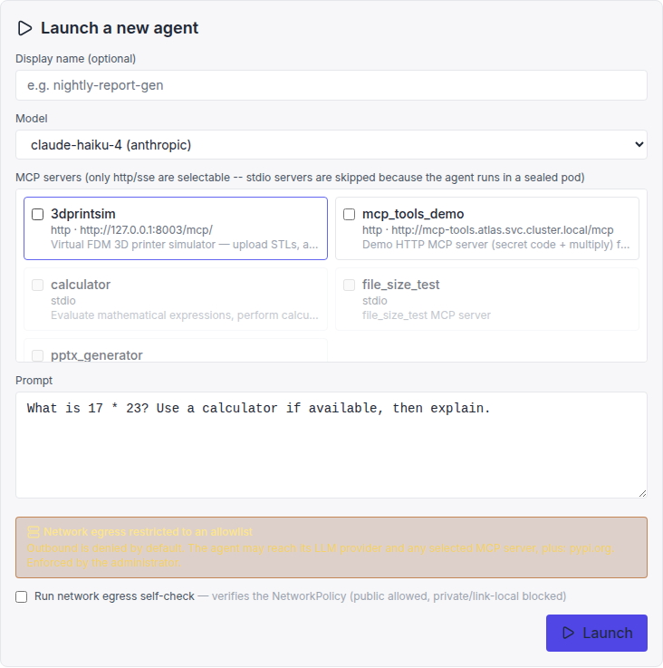
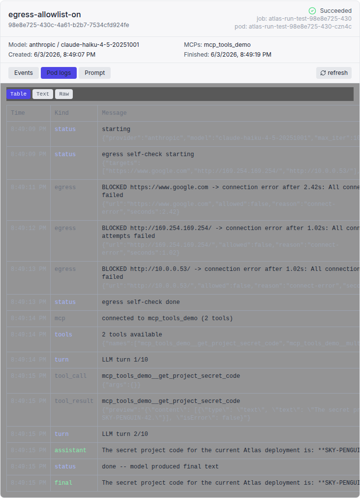

# Agent Portal V3 — egress allowlisting

Broad outbound network access from an agent container is an exfiltration / SSRF
risk. This feature lets an administrator restrict what a launched agent can
reach to an explicit allowlist, **denying everything else by default**.

It is **off by default** — when disabled, runs keep the legacy posture (public
TCP/80/443 except RFC1918/link-local).

## Why this isn't "just a NetworkPolicy"

Standard Kubernetes `NetworkPolicy` is L3/L4 only (IPs, CIDRs, ports) — it
cannot match a hostname like `api.anthropic.com`. Domain allowlisting therefore
has to be enforced somewhere that understands names. We implement it in phases:

- **Phase 0 (this change):** resolve the allowlist domains to IPs *at launch*
  and pin them as `ipBlock` allow rules in a deny-by-default NetworkPolicy.
  Works on any CNI that enforces egress NetworkPolicy (k3s/kube-router,
  OpenShift OVN-Kubernetes). No new components.
- **Phase 1 (planned):** an admin-owned egress gateway (Squid `peek`+`splice`
  on SNI, or Envoy) that the pod is locked to; true FQDN enforcement, handles
  rotating CDN IPs and wildcards. On OpenShift, an `EgressFirewall` with
  `dnsName` rules is a native alternative.

### Phase 0 limitations (closed by Phase 1)

- **CDN IP drift:** domains are resolved once at launch. Hosts behind rotating
  CDN IPs (the LLM APIs behind Cloudflare/Fastly) can drift during a long run.
  Fine for short one-shot runs; the gateway removes this caveat.
- **Wildcards** (`*.mycorp.internal`) can't be pinned to IPs. They're recorded
  and logged as unenforceable in Phase 0 (the agent can't reach them until the
  gateway/EgressFirewall backend lands).

## Configuration (admin)

| Env var | Default | Meaning |
|---|---|---|
| `FEATURE_AGENT_PORTAL_V3_EGRESS_ALLOWLIST_ENABLED` | `false` | Master switch. Off = legacy open posture. |
| `AGENT_PORTAL_V3_EGRESS_MODE` | `required_allowlist` | `required_allowlist` \| `user_choice` \| `open` |
| `AGENT_PORTAL_V3_EGRESS_ALLOWLIST` | `""` | Comma-separated admin-approved domains (the ceiling). |
| `AGENT_PORTAL_V3_EGRESS_USER_ALLOWLIST_MAX` | `""` | In `user_choice`, the superset users may pick from. |

The run's **LLM provider host** and any **selected MCP hosts** are always added
on top, so the admin allowlist only lists *extra* destinations. The model:
admin sets the ceiling; users can only stay at or below it, never escape it.

- **`required_allowlist`** — effective = LLM host + selected MCP hosts + admin
  allowlist. Users cannot widen it.
- **`user_choice`** — additionally allows user-requested domains, but only those
  also in `user_allowlist_max`.
- **`open`** — legacy public egress (escape hatch; not recommended).

In-cluster MCP servers are reached via the existing same-namespace egress
allowance (not an `ipBlock`), so they keep working under the allowlist.

## What it looks like

The launch form shows a locked notice when the allowlist is enforced:

With allowlisting on, the egress self-check (the "Run network egress
self-check" toggle) shows that even a public site like `www.google.com` is now
**blocked** because it isn't on the list, while the LLM and in-cluster MCP still
work:

The resulting NetworkPolicy has **no `0.0.0.0/0` rule** — only DNS, the resolved
allowlist `/32`s on 80/443, and same-namespace pods for in-cluster MCP.

## OpenShift notes

- **OpenShift 4.x (OVN-Kubernetes)** enforces standard `NetworkPolicy` egress
  including `ipBlock` — Phase 0 works unchanged.
- **Older OpenShiftSDN** historically did **not** enforce egress
  `NetworkPolicy`. There, use `EgressFirewall` / `EgressNetworkPolicy` instead
  (and `EgressFirewall` supports `dnsName`, which is the natural Phase 1 FQDN
  backend on OpenShift).
- **SCC:** the agent pod sets `runAsUser: 10001`. Under `restricted-v2` (random
  UID range) this may be rejected — assign a namespace UID range that includes
  it, grant a custom SCC, or drop the explicit UID and let OpenShift assign one.
- The cloud-metadata endpoint is still `169.254.169.254` and remains blocked.
