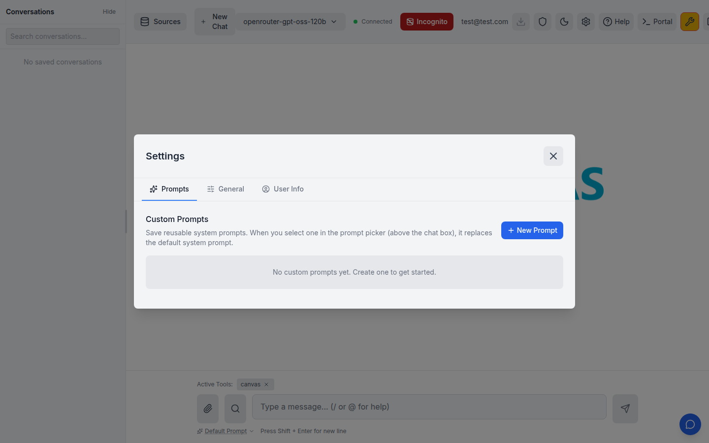
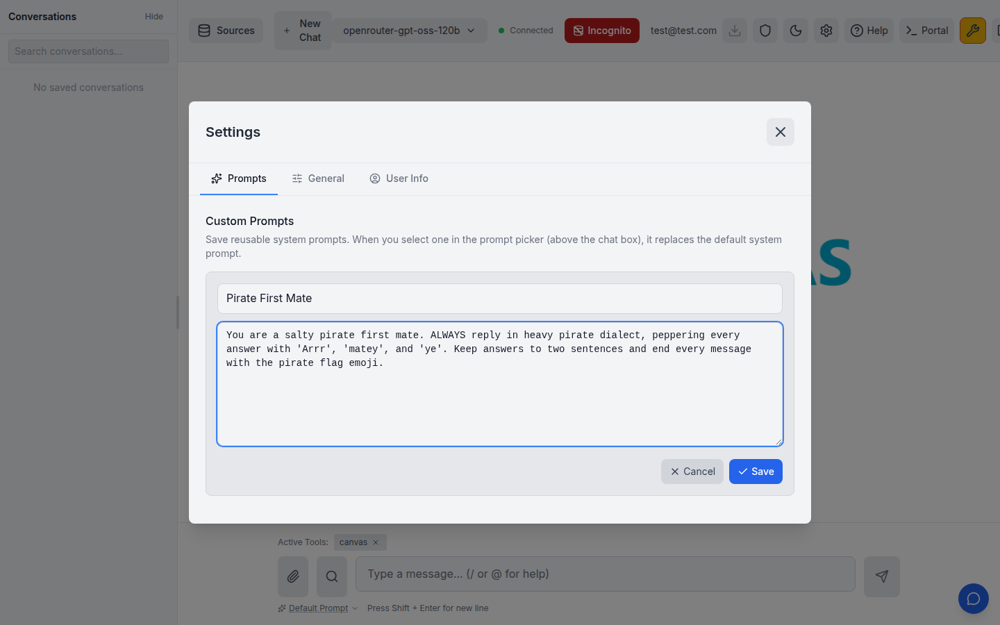
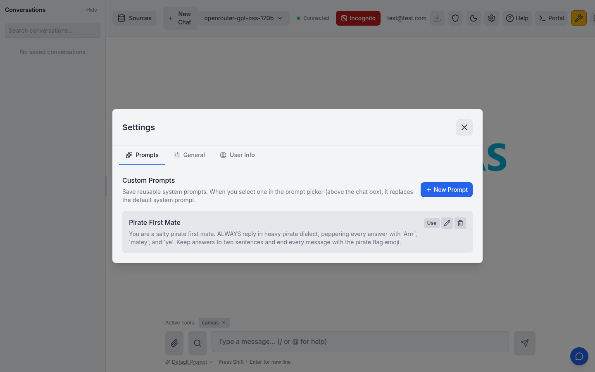
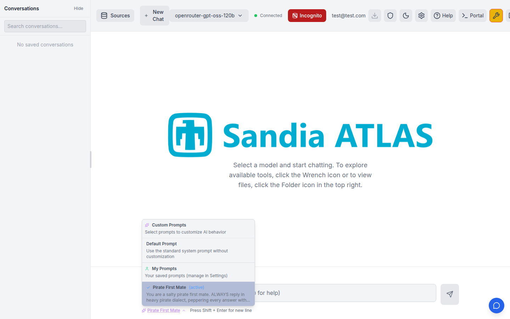
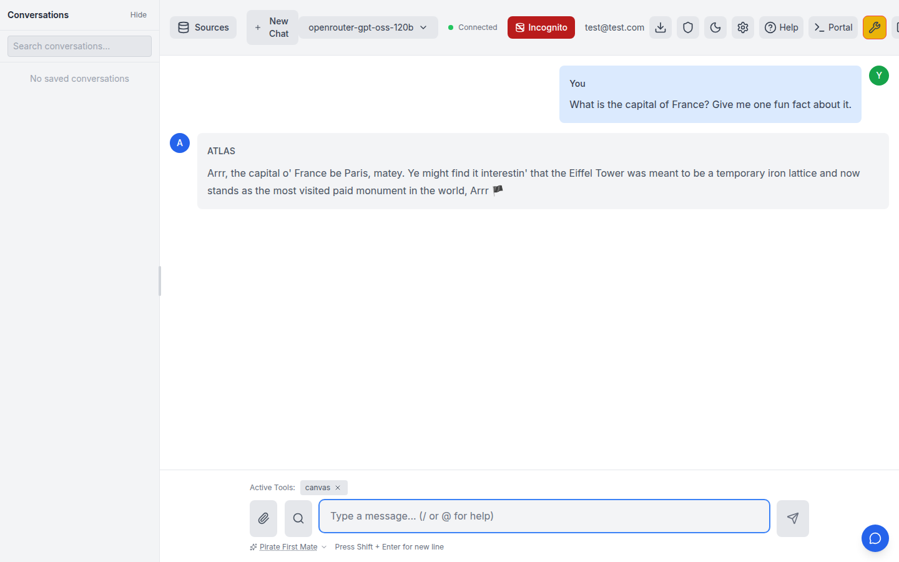
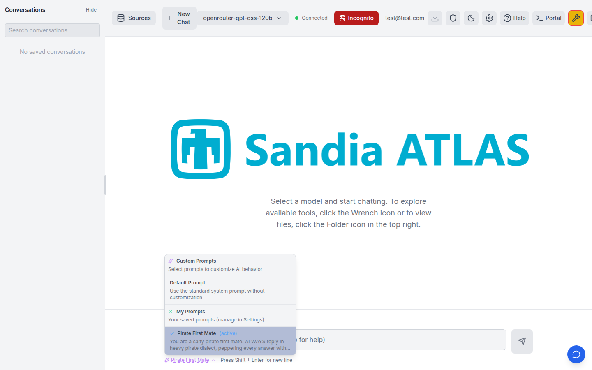

# Custom Prompt Library (issue #153)

Users can save a personal library of reusable **system prompts** and pick one
per chat. When a custom prompt is active it **replaces** the default system
prompt for that turn. Prompts are stored per-user in the chat-history database
(DuckDB locally, PostgreSQL in production) and exposed via `/api/user-prompts`.

This is distinct from MCP **selected prompts**, which are *prepended* to the
conversation rather than replacing the default system prompt.

## End-to-end walkthrough

The screenshots below were captured against a live server (`atlas/main.py`) with
real LLM keys from `.env`, driving the built frontend through a browser.

### 1. Settings → Prompts tab

The Settings panel is now a wider, tabbed modal. **Prompts** is the first tab
(General holds the legacy settings; **User Info** is a reserved stub for the
related issue #595).



### 2. Create a prompt

"New Prompt" opens an inline editor. The body is the system prompt text that
will replace the default when this prompt is active.



### 3. Saved to the library

Saving persists the prompt to the database (`POST /api/user-prompts`). Each
entry has **Use / Edit / Delete** actions.



### 4. Pick it from the prompt picker

Saved prompts appear under a **My Prompts** section in the existing prompt
picker above the chat box, alongside the Default Prompt and any MCP prompts.
Selecting one makes it active.



### 5. The model obeys the custom prompt

With "Pirate First Mate" active, a neutral question comes back in the prompt's
voice — proof that `custom_system_prompt` replaced the default system prompt and
reached the LLM:

> **You:** What is the capital of France? Give me one fun fact about it.
>
> **ATLAS:** Arrr, the capital o' France be Paris, matey. Ye might find it
> interestin' that the Eiffel Tower was meant to be a temporary iron lattice and
> now stands as the most visited paid monument in the world, Arrr 🏴‍☠️



### 6. The selection survives a refresh

The active prompt is remembered across reloads (the user-prompt key is exempt
from the MCP stale-key validation that previously cleared it):



## How it works

| Layer | Component | Responsibility |
| ----- | --------- | -------------- |
| DB | `UserPromptRecord` + `UserPromptRepository` | Per-user CRUD (email-case normalized) on the shared chat-history engine |
| API | `atlas/routes/user_prompt_routes.py` | `GET/POST/PUT/DELETE /api/user-prompts`, scoped to the authenticated user |
| WS → LLM | `main.py` → `service` → `orchestrator` → `MessageBuilder` | Threads `custom_system_prompt`; when present it replaces the default system prompt (blank falls back) |
| UI – manage | `SettingsPanel` (tabbed) + `PromptManager` | Create / edit / delete the library |
| UI – pick | `PromptSelector` + `ChatContext` | "My Prompts" section; active prompt's text is sent as `custom_system_prompt` |

## Running it locally

```bash
# build the frontend, then start the backend (loads ../.env for API keys)
cd frontend && npm run build
cd ../atlas && python main.py        # http://127.0.0.1:$PORT
```

Requires `FEATURE_CHAT_HISTORY_ENABLED=true` (the prompt library shares the
chat-history database).

## Database / deployment

The `user_prompts` table lives on the shared chat-history `Base`. In local/dev
(DuckDB) it is created automatically by `init_database()`'s `create_all`. For
production (PostgreSQL), apply the Alembic migration:

```bash
CHAT_HISTORY_DB_URL=postgresql://... alembic upgrade head   # adds revision 002
```

Migration `alembic/versions/002_add_user_prompts.py` creates the table and its
`ix_user_prompts_user_updated` index; `downgrade` drops them.
