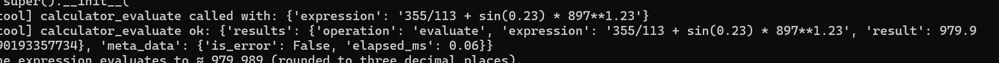

# Atlas CLI and Python API

Last updated: 2026-02-04

## Overview

Atlas provides a non-interactive CLI and Python API for one-shot LLM chat with full MCP tools and RAG support -- no browser or WebSocket needed.


*Example: Using the calculator tool via CLI*

## Tool Naming Convention

Tool names are fully qualified as `{serverName}_{toolName}`, where `serverName` is the key in `mcp.json` and `toolName` is the function name registered in the MCP server.

Default servers from `atlas/config/mcp.json` and their tools:

| Server | Tool name(s) | Description |
|--------|-------------|-------------|
| `calculator` | `calculator_evaluate` | Evaluate math expressions |
| `pdfbasic` | `pdfbasic_*` | PDF text extraction and analysis |
| `code-executor` | `code-executor_*` | Sandboxed code execution |
| `ui-demo` | `ui-demo_*` | UI customization demo |
| `prompts` | (prompts only, no tools) | System prompt overrides |
| `env-demo` | `env-demo_*` | Environment variable demo |

The special pseudo-tool `canvas_canvas` is always available regardless of selection.

## CLI Usage

```bash
cd atlas

# Basic prompt
python atlas_chat_cli.py "Summarize the latest docs" --model gpt-4o

# With tools
python atlas_chat_cli.py "What is 355/113 + sin(0.23) * 897^1.23? Use the tool." --tools calculator_evaluate

# Multiple tools
python atlas_chat_cli.py "Calculate 2^10 then execute print('hello') in Python" \
  --tools calculator_evaluate,code-executor_execute_code

# Read prompt from stdin
echo "Explain quantum computing" | python atlas_chat_cli.py -

# Write output to file
python atlas_chat_cli.py "Generate a report" -o ./report.md

# JSON output (structured result with tool_calls, files, etc.)
python atlas_chat_cli.py "What is 2+2?" --tools calculator_evaluate --json

# List available tools (prints in the format used by --tools)
python atlas_chat_cli.py --list-tools

# List available tools as JSON (useful for scripts/CI)
python atlas_chat_cli.py --list-tools --json

# Use a custom .env file (useful for different environments/API keys)
python atlas_chat_cli.py "Hello" --env-file /path/to/custom.env

# Query RAG data sources (format: server:source_id)
python atlas_chat_cli.py "What are the security policies?" --data-sources atlas_rag:technical-docs

# Query corporate fleet data (e.g., cars in a specific region)
python atlas_chat_cli.py "What corporate cars are available in the west region?" \
  --data-sources corporate_cars:west_region --only-rag

# RAG-only mode (no tools, just retrieval-augmented generation)
python atlas_chat_cli.py "Summarize our compliance docs" --data-sources atlas_rag:technical-docs --only-rag

# List available RAG data sources
python atlas_chat_cli.py --list-data-sources

# List available RAG data sources as JSON (useful for scripts/CI)
python atlas_chat_cli.py --list-data-sources --json

# Override config paths (useful for testing/CI)
python atlas_chat_cli.py --list-data-sources --json \
    --env-file /path/to/custom.env \
    --config-dir /path/to/config \
    --rag-sources-config /path/to/config/rag-sources.json \
    --llm-config /path/to/config/llmconfig.yml

# Combine tools and RAG
python atlas_chat_cli.py "Search docs and calculate statistics" \
  --data-sources atlas_rag --tools calculator_evaluate
```

### CLI Flags

| Flag | Description |
|------|-------------|
| `prompt` | Positional prompt text, or `-` for stdin |
| `--model` | LLM model name (default from config) |
| `--tools` | Comma-separated fully-qualified tool names (`serverName_toolName`) |
| `--data-sources` | Comma-separated RAG sources in `server:source_id` format |
| `--only-rag` | Use only RAG without tools (RAG-only mode) |
| `--list-data-sources` | Print available RAG data sources and exit |
| `-o, --output` | Write response to file path |
| `--json` | Output structured JSON |
| `--user-email` | Override user identity |
| `--list-tools` | Print available tools and exit |
| `--env-file` | Path to custom .env file (default: project root .env) |
| `--config-dir` | Override config directory (sets `APP_CONFIG_DIR`) |
| `--llm-config` | Override LLM config file (sets `LLM_CONFIG_FILE`) |
| `--mcp-config` | Override MCP config file (sets `MCP_CONFIG_FILE`) |
| `--rag-sources-config` | Override RAG sources config file (sets `RAG_SOURCES_CONFIG_FILE`) |
| `--help-config` | Override help config file (sets `HELP_CONFIG_FILE`) |
| `--messages-config` | Override messages config file (sets `MESSAGES_CONFIG_FILE`) |
| `--tool-approvals-config` | Override tool approvals config file (sets `TOOL_APPROVALS_CONFIG_FILE`) |
| `--splash-config` | Override splash config file (sets `SPLASH_CONFIG_FILE`) |
| `--file-extractors-config` | Override file extractors config file (sets `FILE_EXTRACTORS_CONFIG_FILE`) |

### Exit Codes

- `0` - Success
- `1` - Runtime error
- `2` - Bad arguments (no prompt provided)

## Python API

```python
import asyncio
from atlas_client import AtlasClient

async def main():
    client = AtlasClient()
    result = await client.chat(
        prompt="What is 355 divided by 113?",
        model="gpt-4o",
        selected_tools=["calculator_evaluate"],
    )
    print(result.message)
    print(result.tool_calls)
    await client.cleanup()

asyncio.run(main())
```

### Using multiple tools

```python
result = await client.chat(
    prompt="Calculate 2^10 then run print('hello') in Python",
    selected_tools=["calculator_evaluate", "code-executor_execute_code"],
)
```

### Using RAG data sources

Data sources use qualified format: `server:source_id`. For MCP RAG sources where the server name is the source, use `name:name` (e.g., `corporate_cars:corporate_cars`).

```python
# Query with RAG (qualified format: server:source_id)
result = await client.chat(
    prompt="What are our security policies?",
    selected_data_sources=["atlas_rag:technical-docs"],
)

# Query corporate fleet data
result = await client.chat(
    prompt="What cars are in the west region?",
    selected_data_sources=["corporate_cars:west_region"],
    only_rag=True,
)

# List available data sources
result = await client.list_data_sources()
for name, info in result.get("servers", {}).items():
    print(f"{name}: {info.get('description', '')}")
# Or list discovered source IDs:
for source_id in result.get("sources", []):
    print(source_id)
```

### Sync usage

```python
from atlas_client import AtlasClient

client = AtlasClient()
result = client.chat_sync(
    "What is 2+2?",
    model="gpt-4o",
    selected_tools=["calculator_evaluate"],
)
print(result.message)
```

### ChatResult fields

| Field | Type | Description |
|-------|------|-------------|
| `message` | `str` | Assistant's text response |
| `tool_calls` | `list[dict]` | Tool invocations with name, status, result |
| `files` | `dict` | Session files produced by tools |
| `canvas_content` | `str or None` | HTML/markdown canvas content |

## Configuration

The CLI uses the same configuration as the web app:
- `.env` for environment variables
- `config/` for user config and `atlas/config/` for package defaults
- MCP tool discovery runs automatically on first use
- Tool servers are defined in `atlas/config/mcp.json` (or `config/mcp.json` for customization)

For scripted testing and CI, you can override config locations directly via CLI flags (e.g., `--config-dir`, `--llm-config`, `--mcp-config`, `--rag-sources-config`). These are applied before loading `.env` and before importing Atlas modules, so they take precedence over values set in `.env`.

To see which tools are available, check the server keys in your `mcp.json` and the `@mcp.tool` decorated functions in each server's `main.py`.

### Tool Approval

In the web UI, tools may require user approval before execution (configured via `require_approval` in `mcp.json`). The CLI automatically approves all tool calls since there is no interactive approval UI. This applies to all tool calls.

## Use Cases

- **E2E testing**: Script chat interactions for automated testing
- **MCP development**: Test tool servers without starting the full UI
- **Scripted workflows**: Chain LLM calls in shell scripts or Python
- **CI/CD**: Validate LLM + tool integrations in pipelines
