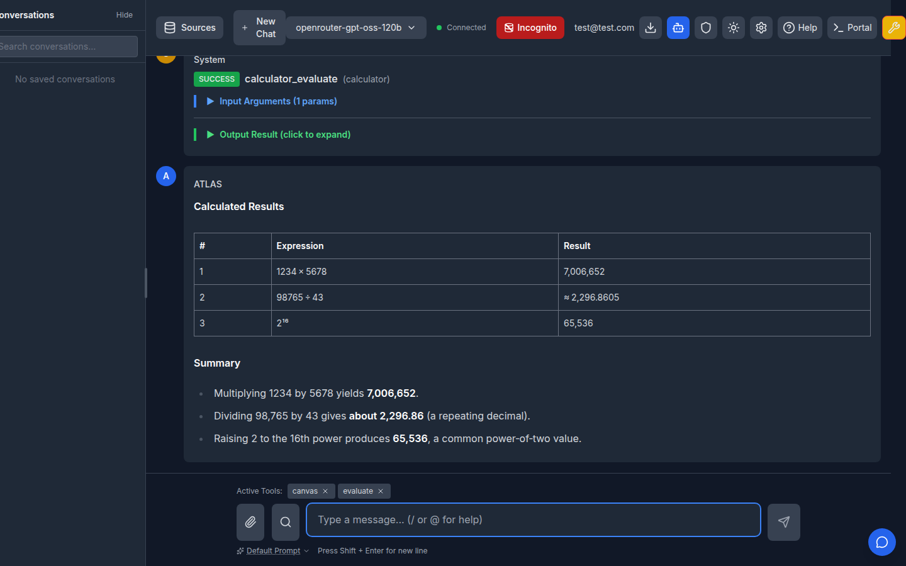
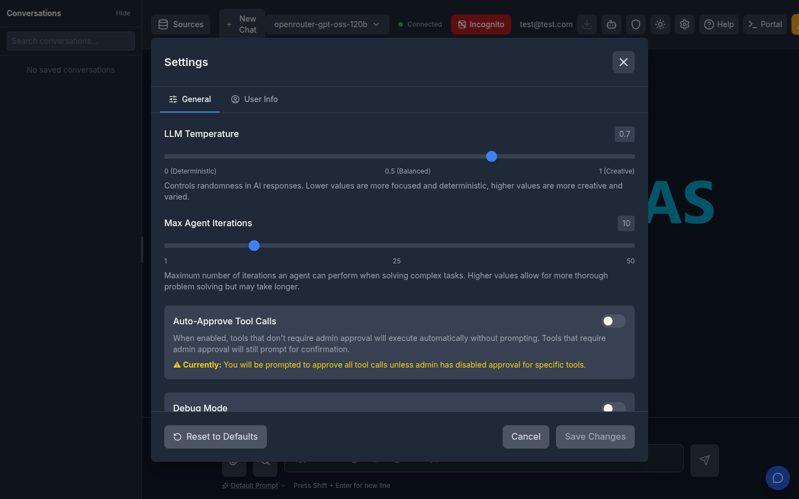
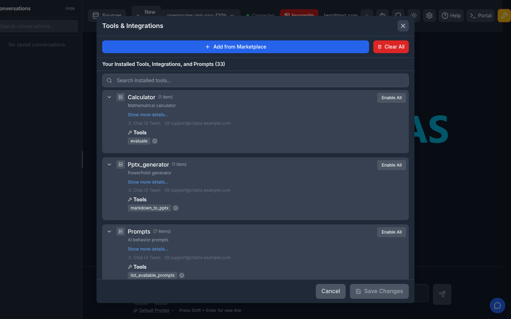

# Agentic Loop (the single agent loop)

Last updated: 2026-06-20

> **Update (PR #664):** ATLAS now has exactly one agent loop — the native
> `agentic` loop described here. The former `react`, `think-act`, and `act`
> strategies (and their scaffolding "control tools" and forced
> `tool_choice="required"`) were removed. Forcing tool choice was unsupported
> by several providers and the control-tool/JSON parsing was fragile. The
> `AGENT_LOOP_STRATEGY` setting and the `agent_loop_strategy` request field
> are still accepted for backward compatibility but always resolve to the
> agentic loop. This matches the product direction in `AGENTS.md` ("the in-app
> agent loop is not the focus").

## Overview

The agentic agent loop mirrors how Claude Code and Claude Desktop drive tool-use loops. It uses zero control tools and `tool_choice="auto"`, trusting the model to manage its own control flow. When the model responds with text only (no tool calls), the loop is done.

It is the simplest and most token-efficient design: 1 LLM call per step, no scaffolding, and identical behavior across providers (OpenAI, Anthropic, Gemini, Bedrock) via LiteLLM.

## Configuration

```bash
# In .env or environment
AGENT_LOOP_STRATEGY=agentic
```

Or via the `AGENT_LOOP_STRATEGY` alias (both are accepted by Pydantic's `AliasChoices`).

## How It Works

```
while steps < max_steps:
    response = llm.call_with_tools(messages, tools, tool_choice="auto")

    if no tool_calls in response:
        return response.content  # Done

    execute all tool_calls in parallel
    append assistant + tool result messages
    loop back

# Max steps exhausted: call llm.call_plain for synthesis
```

Key behaviors:

- **No control tools**: The loop injects no scaffolding tools (no `finished`, `agent_decide_next`, etc.) into the schema. The model sees only the real user tools.
- **`tool_choice="auto"`**: The model naturally decides between calling tools and responding with text. Tool choice is never forced — forcing it (`"required"`) is unsupported by several providers and forbids the model from answering directly.
- **Text-only response = done**: The simplest possible completion signal. No JSON parsing, no control-tool extraction, no fallback heuristics.
- **Parallel tool execution**: When the model returns multiple tool calls in one response, all execute concurrently via `asyncio.gather` (shared `execute_multiple_tools` from PR #358). Each result is appended as a `role: "tool"` message keyed by `tool_call_id`, then the full message list is re-sent on the next step.
- **Streaming support**: When streaming is enabled, text tokens are published to the UI as they arrive; tool-call responses are handled non-streaming.

## End-to-end verification (PR #664)

Captured against a local instance running this branch.

The agent runs the only strategy (`agentic`) and executes multiple real MCP tool
calls in one turn before answering — the prompt "compute 1234×5678, 98765/43, and
2^16" drives three `calculator_evaluate` calls, then a text-only summary ends the
loop:



The Settings panel keeps agent mode (Max Agent Iterations) but no longer exposes a
loop-strategy selector, and the Tools panel no longer has a "Required Tool Usage"
(forced `tool_choice`) toggle:

| Settings (no strategy selector) | Tools (no forced-tool toggle) |
|---|---|
|  |  |

## Architecture

The implementation lives in `atlas/application/chat/agent/agentic_loop.py`:

- Implements `AgentLoopProtocol` from `atlas/application/chat/agent/protocols.py`
- Registered in `AgentLoopFactory` at `atlas/application/chat/agent/factory.py`
- Uses `tool_executor.execute_multiple_tools` for parallel tool execution
- Uses `stream_final_answer` for streaming the max-steps fallback
- Emits standard `AgentEvent`s (`agent_start`, `agent_turn_start`, `agent_tool_results`, `agent_completion`)

## File Reference

- Implementation: `atlas/application/chat/agent/agentic_loop.py`
- Tests: `atlas/tests/test_agentic_loop.py` (14 tests)
- Factory: `atlas/application/chat/agent/factory.py`
- Config: `atlas/modules/config/config_manager.py` (`agent_loop_strategy` field)
