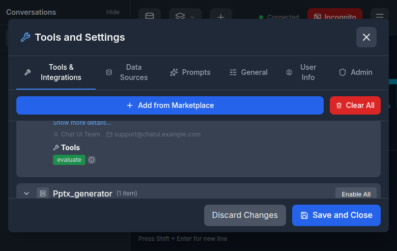
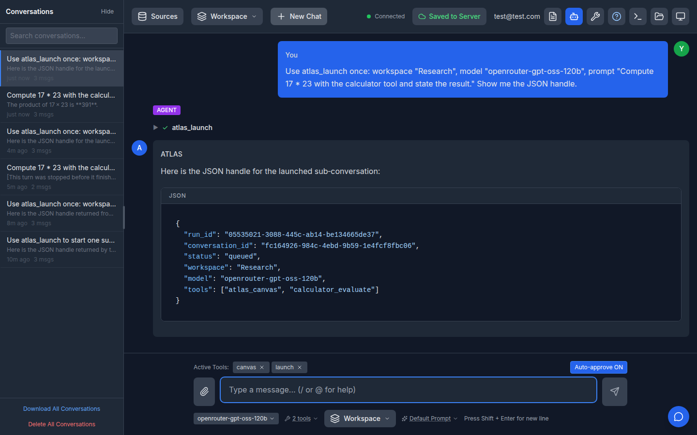
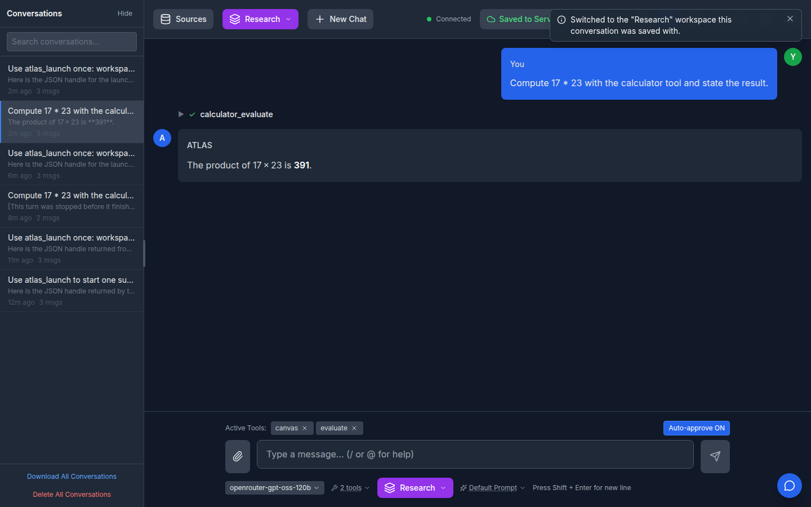

# `atlas_launch`: a conversation that launches conversations (issue #925)

Date: 2026-09-13

## What shipped

A fifth built-in tool on the `atlas` server, `atlas_launch`, lets a conversation start
*sub-conversations* -- ATLAS's own equivalent of subagents. It takes three inputs:

| Input | Meaning |
|---|---|
| `workspace` | One of the caller's saved workspaces. It carries the child's tools **and** its data sources, so the whole capability surface is one handle the user already configures and can audit. |
| `model` | Which configured model the child runs on, so a parent on an expensive model can fan work out to a cheaper one. |
| `prompt` | The task. The child starts with no memory of the parent, so the prompt must stand alone. |

The call returns a **handle** -- the child's `run_id` and `conversation_id` -- as soon as the
run is admitted, and never waits for the answer.

## What it looks like running

The tool appears in the built-in `atlas` server alongside canvas, sleep and search, and is
selectable like any other tool:

The launching conversation gets the handle back immediately -- the call does not wait for the
sub-conversation's answer:

The sub-conversation is its own conversation in history, with its own transcript, its own tool
rows and the workspace it ran under:

## Why a handle and not the answer

Blocking would have been simpler for the model to use, and it was the open question on the
issue; the decision there was "return handle immediately with some id". Blocking also costs
the thing fanning out is meant to buy: the parent's agent loop (and its model context) would
stay pinned open for the child's entire lifetime, so N children would serialize into N
sequential turns wearing a parallel costume. With a handle, the parent keeps working and the
child's transcript lands in its own conversation in history -- which is where the user reads
the result, and what makes a child reopenable, steerable and stoppable like any other run.

## Why the machinery was mostly already there

Issue #884 gave ATLAS a run registry that owns several concurrent runs on one connection, and
#915 collapsed event tagging into one authority so a run's output routes to *its own*
conversation. A launched run is just another entry in that registry:

- It gets its own `run_id`, `conversation_id` and `session_id`.
- Its task binds `set_current_run`, so every frame the chat pipeline publishes underneath it is
  stamped with the child's identity before it reaches the client.
- Because it has no socket of its own (it is started from inside a tool call), its events
  travel out over the parent's connection through a small `_ChildConnection` adapter that
  stamps the child's ids *first*. The tagging rule is setdefault-based, so nothing downstream
  can relabel a child's tokens as the parent's and splice them into the visible transcript.

## The boundaries

**Authorization.** The child can never exceed the caller:

- The workspace is looked up scoped to the caller's email, so guessing another user's
  workspace id returns "not found" rather than that user's selections.
- The model goes through the same `check_model_access` every other entry point uses. `UNKNOWN`
  and `DENIED` produce an identical message, so `atlas_launch` cannot be used to probe the
  deployment's restricted model list.
- The workspace's stored tool list is re-filtered through the caller's ACLs **at launch time**.
  A workspace is a saved bookmark and the ACLs behind it move; trusting the stored list would
  let a workspace saved last month resurrect a tool the user has since lost.
- Data sources travel only when the workspace has RAG switched on, and are authorized per
  source (group membership, compliance level) by the RAG service when the child queries them --
  the same enforcement a turn the user runs themselves goes through.
- A launch from an incognito or local-save turn is refused: the child persists its own
  transcript, which is the one thing that turn asked not to happen.

**Limits.** `ATLAS_LAUNCH_MAX_DEPTH` (default 2) bounds recursion -- a user-started run is
depth 0, the child it launches is depth 1. `ATLAS_LAUNCH_MAX_CHILDREN_PER_RUN` (default 3)
bounds fan-out per run. `MAX_CONCURRENT_RUNS_PER_USER` still applies underneath, so the
per-user ceiling on concurrent runs is unchanged by this feature.

**Cancellation.** `RunRegistry.cancel` now cascades to a run's children, one level at a time,
so stopping a parent stops the tree beneath it. The cascade runs *before* the "already
terminal" check, because a handle-returning launch means the parent turn normally finishes
while its children are still working -- cascading only for a live parent would make the
guarantee true in the rare case and false in the common one. For the same reason a finished
parent is not reaped while it still has live children. The wall-clock backstop cascades the same way:
a parent stopped for exceeding its budget must not leave sub-conversations running with nobody
watching.

**Tool approval.** Running the feature in the app surfaced the question the unit tests
could not: *who answers the child's tool approvals?* Approval is enforced server-side on every
tool call, and the only thing that answers one is a browser looking at that conversation --
the auto-approve setting is a client behaviour, not a server one. A launched run is not in the
user's history until its first save, so it would pause on its first tool call with nobody able
to answer, forever.

The approval that covers the child is therefore the one the user already gave for the
`atlas_launch` call itself: that call goes through the normal gate and names the workspace, the
model and the task. A child whose tools are all user-level runs pre-approved. Tools an admin has
pinned to mandatory approval (`FORCE_TOOL_APPROVAL_GLOBALLY`, per-tool config) are exempt --
they keep prompting inside the child, and the handle returns them in `tools_needing_approval`
so the model can tell the user the run will wait for them.

**Feature gate.** `FEATURE_ATLAS_LAUNCH_ENABLED` is off by default, and is only effective with
chat history and agent mode also on -- a launched run *is* a background run, and needs the same
ground. The gate is enforced in three places, matching how the other built-ins are handled:
the schema sent to the model, tool authorization, and execution itself (a saved conversation or
a non-UI client can still name a tool the deployment has since switched off).

## Observation tools

When the launch feature is enabled, the parent also receives two non-blocking tools:

- `atlas_get_runs` lists only direct children of the current run. Each entry includes `run_id`, `conversation_id`, `status`, timestamps, `waiting_on`, and any terminal error.
- `atlas_result` accepts a child `run_id` and returns its status immediately. A completed child includes the last assistant message when readable; running, waiting, failed, and cancelled children do not block. Results are scoped to the current user's direct children, and guessed or foreign IDs are refused.

Statuses are `queued`, `running`, `waiting_for_input`, `completed`, `failed`, and `cancelled`. The tools share `FEATURE_ATLAS_LAUNCH_ENABLED` with `atlas_launch`, and are omitted from schemas and authorization when the feature is off.

## Known edges

- A child paused on an admin-mandated approval is not reachable until its conversation is saved
  and opened; the request itself replays correctly once it is (the approval manager is keyed by
  tool call id, so the answer routes back even though the child holds its own ChatService).
  Surfacing a running sub-conversation in the history list before its first save is the obvious
  follow-up.
- The child sends *past* the parent turn's `ToolCallRecorder` (which would otherwise persist
  the child's tool rows into the parent's transcript); the recorder also drops frames tagged
  with a run that is not its own, as defence in depth.
- A launch from an *untracked* turn (history off for that turn) is admitted as depth 0 with no
  parent record, so there is nothing for a parent cancel to cascade from. The returned handle
  says so via a null `parent_run_id`.

## Where the code lives

- `atlas/application/chat/runs/launcher.py` -- admission, authorization, limits, the child task.
- `atlas/application/chat/runs/registry.py` -- `parent_run_id` / `depth`, `children_of`, cascade.
- `atlas/modules/mcp_tools/atlas_server.py` -- the tool schema.
- `atlas/tests/test_atlas_launch_tool.py` -- the boundaries above, pinned.
