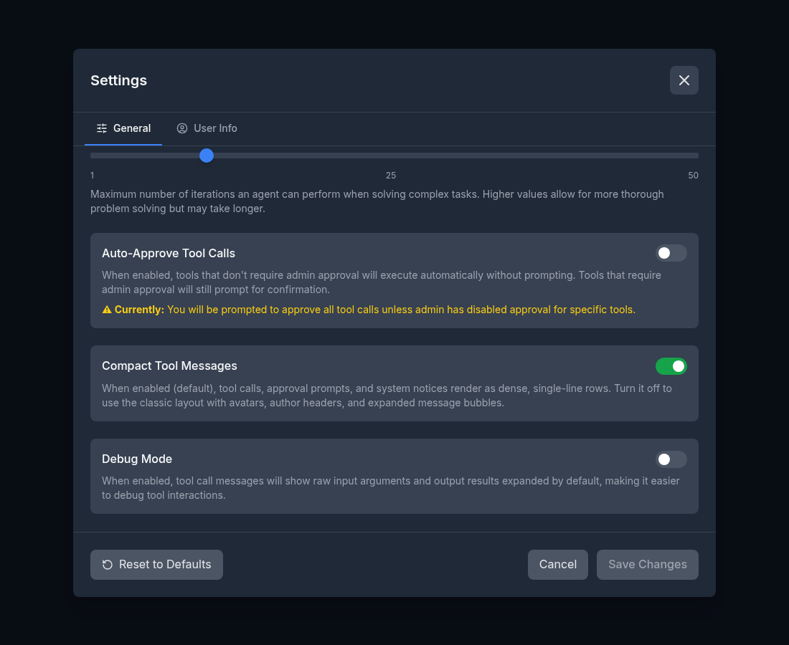
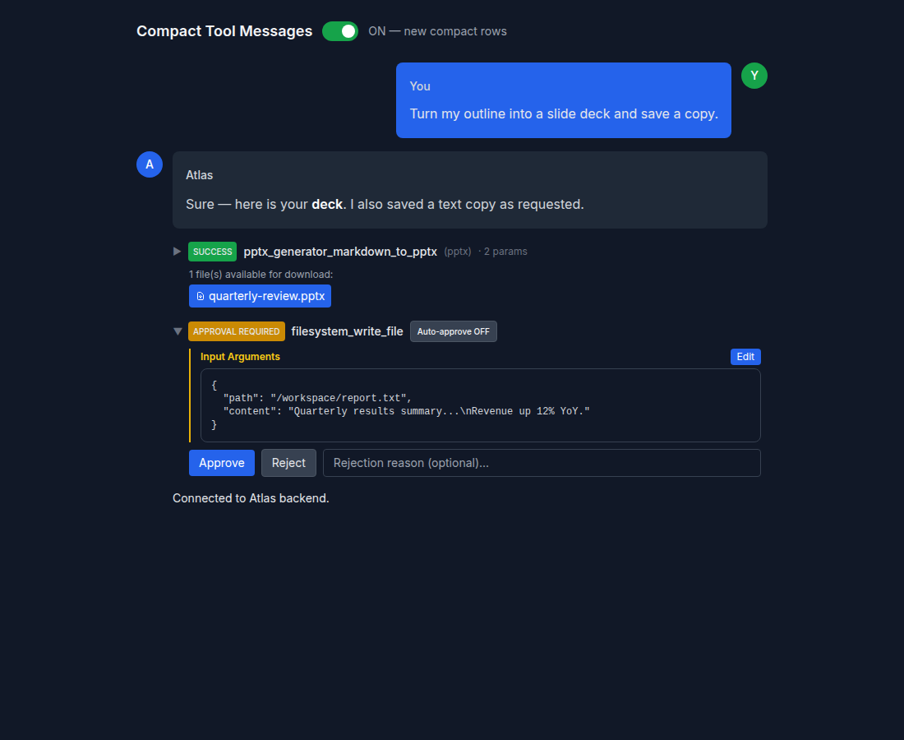
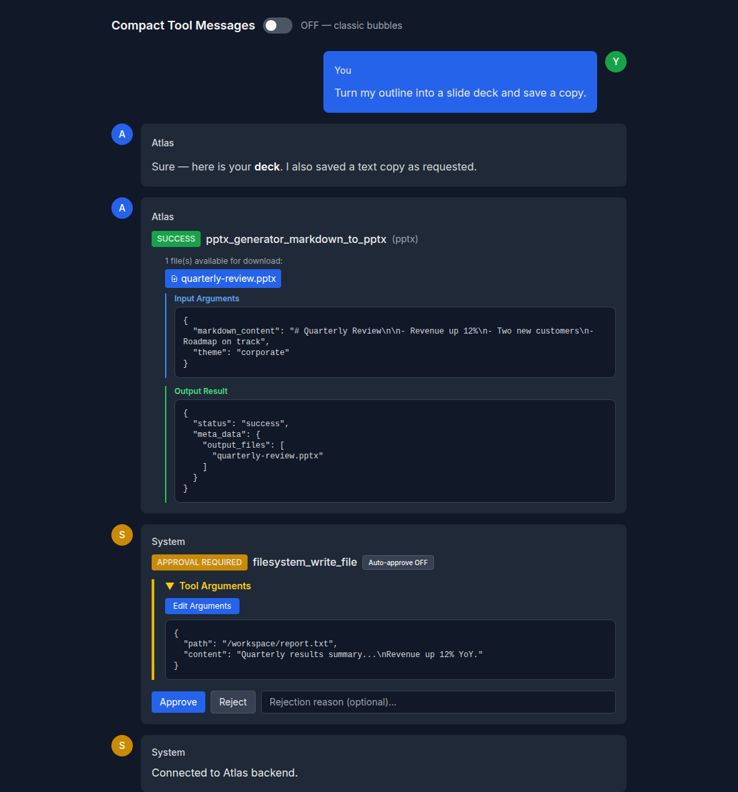

# Compact Tool / System / Approval Messages

Date: 2026-06-23

## Background

Tool calls, tool logs, agent-loop meta, and system notices already rendered as
"compact" rows in the transcript — no avatar, author header, or bubble chrome —
so the conversation stays dense. Tool-approval prompts were the exception: they
rendered inside the full `System` bubble and, when auto-approve was on, opened
their argument JSON expanded by default. A single auto-approved call (e.g.
`pptx_generator_markdown_to_pptx` with a long `markdown_content`) took more
vertical space than the actual tool-call output below it, and the expand/collapse
choice was never remembered — it reset to expanded on every render and every
page reload.

## Change

`ToolApprovalMessage` now matches the tool-call row exactly:

- **Compact path.** `tool_approval_request` is routed through the same
  avatar-less / header-less / bubble-less layout as `tool_call` in
  `Message.jsx`.
- **Persisted collapse.** The arguments panel collapses to a single header line.
  The choice is stored in `localStorage['toolApprovalArgsCollapsed']`, so closing
  it sticks across messages and survives a reload (F5).
- **Smart default.** With no saved preference, auto-approved calls start
  collapsed (informational — the tool runs regardless) while calls that require
  the user's action start expanded so the arguments are reviewable. Auto-approved
  rows read/write the persisted `localStorage['toolApprovalArgsCollapsed']`
  preference; review-required rows use per-message local state so they always
  open expanded for the reviewer and never inherit a collapsed global default
  (and collapsing one doesn't overwrite the auto-approved preference).
- **Local decision state.** The backend never echoes a status change back for an
  approval message — it just unblocks the waiting tool executor (see
  `atlas/main.py` `tool_approval_response`). So once the user clicks
  Approve/Reject, the component records the choice locally, immediately swaps the
  Approve/Reject controls for a resolved `[APPROVED]` / `[REJECTED]` badge, and
  guards the handlers against a second submit. Without this the buttons would
  stay live (duplicate-submit) and the terminal badge would never appear.
- **Matched styling.** The single-line summary is `▶ [STATUS] tool_name · N
  params`; the expanded panel uses the same `ml-5` / `border-l-2` /
  `Input Arguments` treatment as the tool-call row's Input/Output panels. The
  terminal approved/rejected state collapses to a one-line `[APPROVED] tool_name`.

The dead `ToolApprovalDialog.jsx` (a modal variant of the approval UI, no longer
rendered anywhere in the app) and its test were removed.

## Screenshots

Auto-/approval-required call, collapsed to a single line by default:

Expanded on click — compact `Input Arguments` panel matching the tool-call style:

Resulting compact tool-call `SUCCESS` row with download buttons and the
assistant response:

## Opt-out toggle

Some users prefer the previous, fuller layout. A **Compact Tool Messages**
switch was added under Settings → General (on by default), persisted in
`localStorage['chatui-settings'].compactMessages` like the other user settings.

When turned **off**, the compact path is bypassed for every affected row type
(tool calls, approval prompts, tool logs, agent meta, system notices): they
render again inside the classic avatar / author-header / bubble layout. The
toggle controls **chrome only** — collapse/expand behavior is shared across both
modes, so a tool-call row still collapses to a clickable summary that defaults
collapsed (and approval arguments still follow the smart default above),
matching the pre-#673 layout where tool input/output were collapsible. The flag
is read in `Message.jsx` (`compactMessages = settings?.compactMessages !== false`)
and gates both the outer wrapper (`isCompact`) and the inner header chrome (badge
sizing, avatar/header), not the `toolDetailsCollapsed` collapse state;
`ToolApprovalMessage` takes a `compact` prop and renders the classic full-bubble
approval layout when it is false.

The toggle in Settings → General:

Same transcript with compact **on** (default) vs **off** (classic bubbles):

## Files

- `frontend/src/components/ToolApprovalMessage.jsx` — compact layout + persisted collapse; `compact` prop for the classic fallback
- `frontend/src/components/Message.jsx` — route `tool_approval_request` through the compact path; gate compact rendering on the setting
- `frontend/src/hooks/useSettings.js` — `compactMessages` default (true)
- `frontend/src/components/SettingsPanel.jsx` — General-tab toggle
- `frontend/src/components/ToolApprovalDialog.jsx` (removed) + its test
