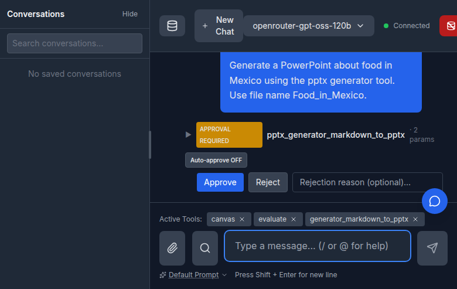
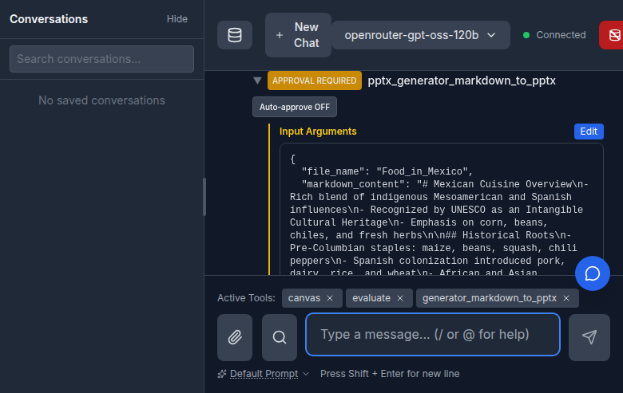
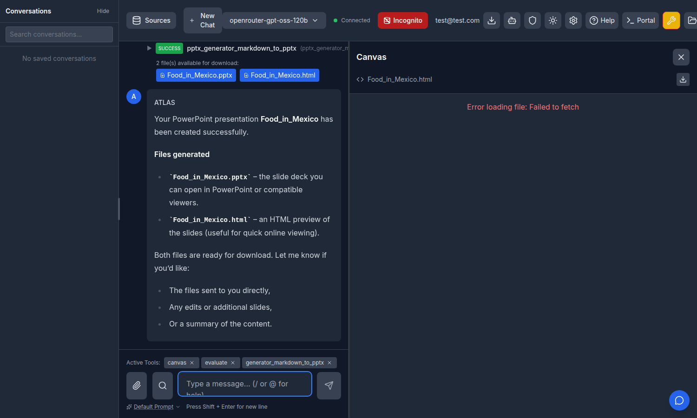

# Compact Tool / System / Approval Messages

Date: 2026-06-23

## Background

Tool calls, tool logs, agent-loop meta, and system notices already rendered as
"compact" rows in the transcript — no avatar, author header, or bubble chrome —
so the conversation stays dense. Tool-approval prompts were the exception: they
rendered inside the full `System` bubble and, when auto-approve was on, opened
their argument JSON expanded by default. A single auto-approved call (e.g.
`pptx_generator_markdown_to_pptx` with a long `markdown_content`) took more
vertical space than the actual tool-call output below it, and the expand/collapse
choice was never remembered — it reset to expanded on every render and every
page reload.

## Change

`ToolApprovalMessage` now matches the tool-call row exactly:

- **Compact path.** `tool_approval_request` is routed through the same
  avatar-less / header-less / bubble-less layout as `tool_call` in
  `Message.jsx`.
- **Persisted collapse.** The arguments panel collapses to a single header line.
  The choice is stored in `localStorage['toolApprovalArgsCollapsed']`, so closing
  it sticks across messages and survives a reload (F5).
- **Smart default.** With no saved preference, auto-approved calls start
  collapsed (informational — the tool runs regardless) while calls that require
  the user's action start expanded so the arguments are reviewable. Once the user
  toggles it, their choice wins globally.
- **Matched styling.** The single-line summary is `▶ [STATUS] tool_name · N
  params`; the expanded panel uses the same `ml-5` / `border-l-2` /
  `Input Arguments` treatment as the tool-call row's Input/Output panels. The
  terminal approved/rejected state collapses to a one-line `[APPROVED] tool_name`.

The dead `ToolApprovalDialog.jsx` (a modal variant of the approval UI, no longer
rendered anywhere in the app) and its test were removed.

## Screenshots

Auto-/approval-required call, collapsed to a single line by default:

Expanded on click — compact `Input Arguments` panel matching the tool-call style:

Resulting compact tool-call `SUCCESS` row with download buttons and the
assistant response:

## Files

- `frontend/src/components/ToolApprovalMessage.jsx` — compact layout + persisted collapse
- `frontend/src/components/Message.jsx` — route `tool_approval_request` through the compact path
- `frontend/src/components/ToolApprovalDialog.jsx` (removed) + its test
