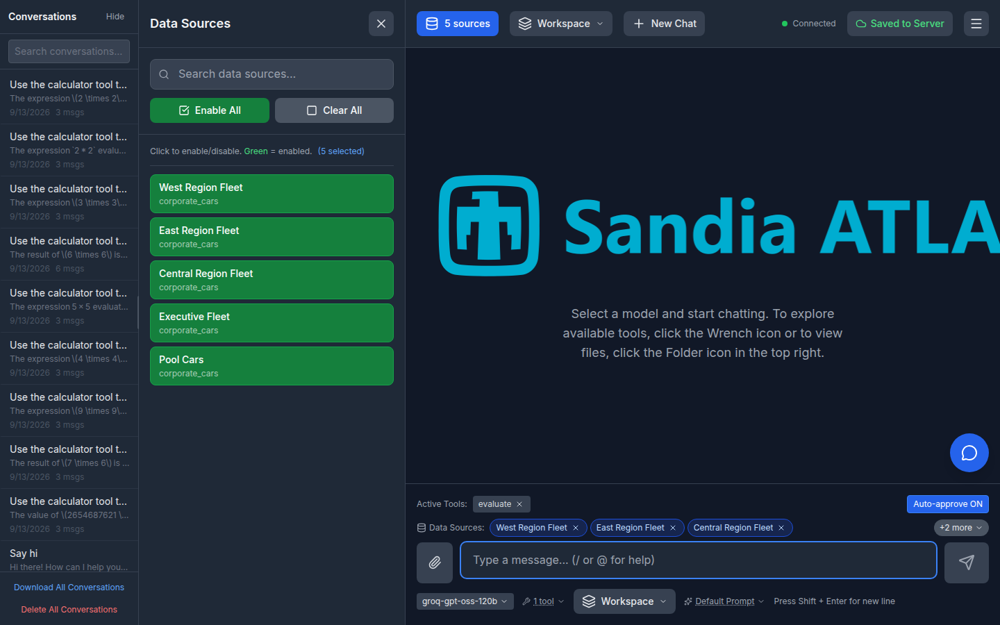
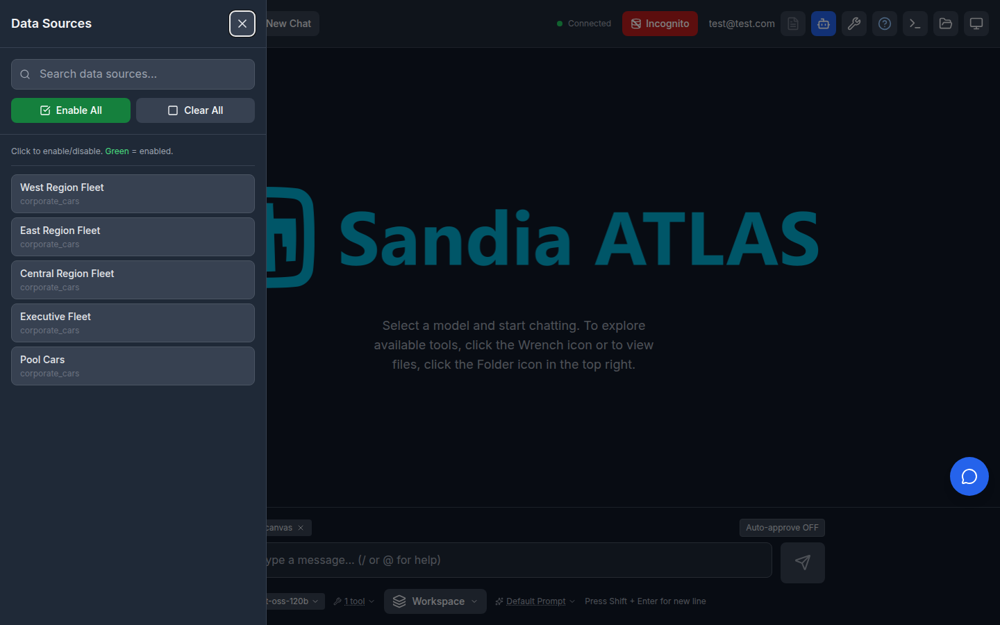

# RAG Sources Drawer as an Overlay

Date: 2026-10-08

Issue #1037 reported that opening the left-hand **Data Sources / RAG Sources**
drawer shifted the whole chat area to the right on desktop viewports, and
closing it let the content jump back. The report was noticed with compliance
filtering enabled, but compliance was incidental: the drawer's layout classes
never branched on compliance, so the shift happened with or without it.

## Cause

`RagPanel` positioned the drawer `fixed` (a true overlay) at mobile widths,
but switched to in-flow positioning at the `lg` breakpoint:

- `lg:relative lg:translate-x-0 lg:w-96` made the drawer a flex child of the
  row shared with the conversation sidebar and the main content, so while open
  it occupied 384px of real layout width.
- `lg:hidden` (applied when closed) removed it from the layout entirely, so
  the next open re-inserted it and reflowed everything.

Because the desktop behavior had no slide animation either, the shift was an
instant jump: chat header at `left: 200px` closed, `left: 584px` open.

## Fix

The drawer is now an overlay at every breakpoint. It stays `fixed left-0
top-0` and out of document flow (`w-80`, `lg:w-96` on desktop), sliding over
the chat with the same transform transition mobile already had, and the
click-outside backdrop is no longer excluded at desktop widths. The closed
drawer stays mounted off-screen, marked `aria-hidden` and `inert`.

Measured geometry (Playwright, header bounding box, 1440x900 unless noted):

| Scenario                      | Before: closed -> open      | After: closed -> open  | Shift |
| ----------------------------- | --------------------------- | ---------------------- | ----- |
| Sidebar open (200px)          | left 200 -> 584             | left 200 -> 200        | +384 -> 0 |
| Sidebar collapsed (40px rail) | left 40 -> 424              | left 40 -> 40          | +384 -> 0 |
| 390x800 mobile                | left 0 -> 0 (already overlay) | left 0 -> 0          | unchanged |

## Modal behavior

Making the drawer an overlay at all widths turned it into a modal on desktop,
so it gained the treatment the other overlays already had (issue #1037 review):

- `role="dialog"`, `aria-modal="true"`, labelled by its heading.
- Focus enters the drawer (its close button) when it opens and returns to the
  previously focused element when it closes.
- Tab is trapped inside while it is open, so focus cannot walk the covered
  header controls behind the backdrop. The trap listens on `document` rather
  than on the drawer itself, so it also catches focus that strays outside
  (e.g. to `<body>` after a control disabled itself), and it stands down
  while focus is inside a different dialog layered on top of the drawer.
- Escape closes it, via the shared `useEscapeKey` hook; the header toggle's
  `onClose`/`onToggleRag` callbacks are stable (`useCallback`) so the Escape
  listener is not resubscribed on every app render.

One deliberate non-change: `useEscapeKey` still uses `stopPropagation()`, not
`stopImmediatePropagation()`. Changing the shared hook would alter how every
overlay in the app resolves simultaneous Escapes and deserves its own PR.

The drawer covers the banner strip while it is open -- the same overlay
behavior it always had at mobile widths -- which the user guide now states
explicitly.

## Testing

`frontend/src/test/rag-drawer-overlay-layout.test.jsx` pins the layout and
modal behavior: the drawer keeps `fixed` positioning and `lg:w-96`, never
carries `lg:relative` or `lg:hidden`, the backdrop exists only while open,
Escape and the backdrop close it, and the focus/Tab-trap behavior holds. jsdom
has no CSS engine, so the tests pin the Tailwind class strings and the browser
measurements above carry the visual geometry.
