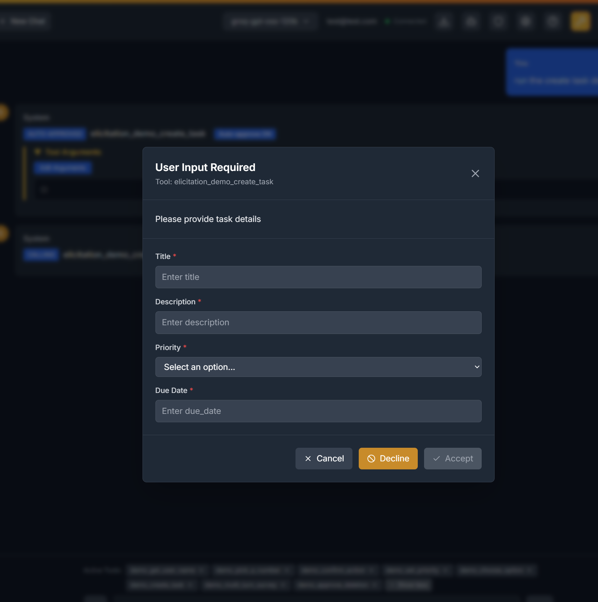
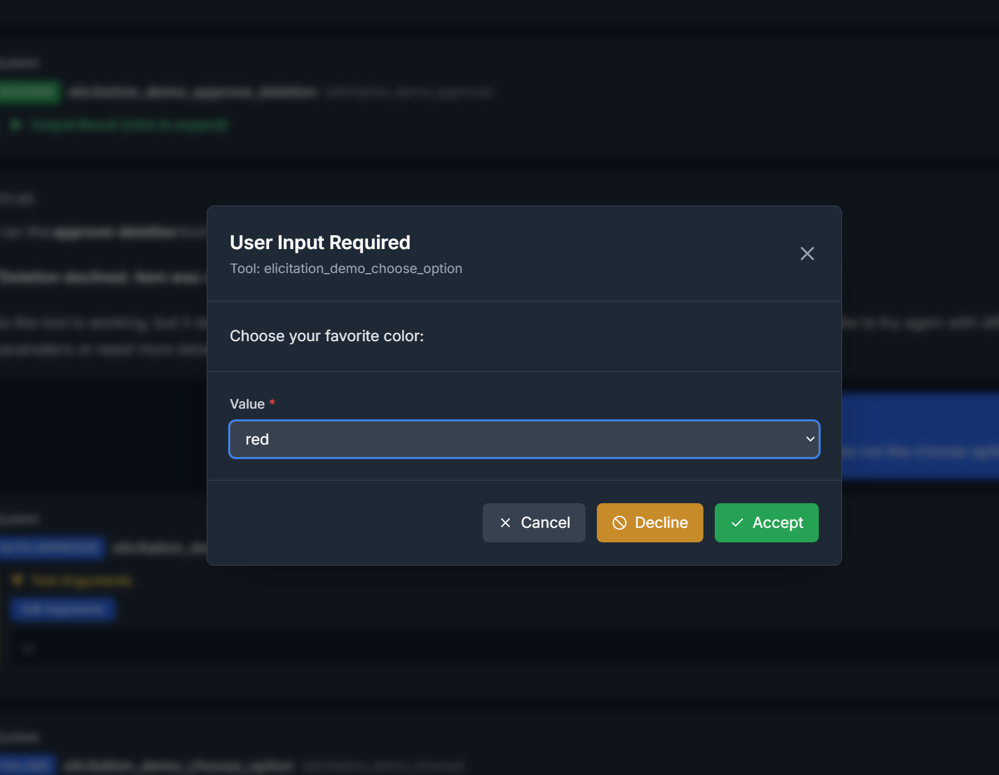

# Interactive Tool Elicitation

**Last updated: 2026-01-07**

Atlas UI 3 supports **interactive tool elicitation**, an advanced MCP feature that enables MCP tools to request additional information from users during execution. Unlike traditional tools that require all inputs upfront, elicitation allows for dynamic, conversational workflows.

## What is Elicitation?

Elicitation allows MCP tools to pause their execution and ask users for additional information through interactive dialogs. This creates more flexible and powerful tool experiences where:

- Tools can gather information progressively
- Users can provide clarification or additional context
- Complex workflows can adapt based on user responses
- Tools can seek approval before performing sensitive operations

## How It Works

When a tool calls `ctx.elicit()`, Atlas UI 3 displays a modal dialog to collect the requested information. The tool waits for your response before continuing execution.

### Response Types

Tools can request different types of information:

- **Text Input**: Simple string information (names, descriptions, etc.)
- **Number Input**: Numeric values with validation
- **Boolean**: Yes/no or true/false questions
- **Enum/Selection**: Choose from predefined options
- **Structured Forms**: Multiple fields collected simultaneously
- **Multi-turn**: Sequential collection through multiple dialogs

### User Actions

Each elicitation dialog provides these options:

- **Accept**: Submit the provided information and continue tool execution
- **Decline**: Skip providing information (tool handles gracefully)
- **Cancel**: Abort the entire operation

## Dialog Examples

### Task Creation Form

When a tool needs to create a task, it can collect all details at once:

The form requests title, description, priority level, and due date in a single structured dialog.

### Option Selection

For cases where you need to choose from predefined options:

Here the tool presents favorite color choices from which you can select.

## Trying Elicitation

To experience elicitation features:

1. **Access Admin Panel**: Log into Atlas UI 3 and go to the admin panel
2. **Enable Demo Server**: Enable the `elicitation_demo` MCP server
3. **Try These Prompts**:
   - "Create a task by asking me for the details"
   - "Ask me to pick a favorite color"
   - "Get my name and run a survey about my preferences"
   - "Test the approval process for a deletion action"

### Available Demo Tools

The elicitation demo MCP server includes these example tools:

- **`get_user_name`**: Basic text input for collecting a name
- **`pick_a_number`**: Numeric input with range validation
- **`confirm_action`**: Boolean yes/no confirmation
- **`set_priority`**: Enum selection from predefined levels
- **`choose_option`**: String literal selection from color options
- **`create_task`**: Structured form with multiple fields
- **`multi_turn_survey`**: Sequential multi-turn data collection
- **`approve_deletion`**: Approval-only (no additional data)

## Best Practices

### For Users

- **Complete Required Fields**: Fields marked as required must be filled to accept
- **Use Cancel for Early Exit**: If you want to completely abort, use Cancel
- **Decline to Skip**: Use Decline if you don't want to provide information

### For Tool Developers

Elicitation is powered by FastMCP 2.10.0+. When building MCP tools:

- Design single-turn elicitations when possible for better UX
- Provide clear, concise prompts
- Always handle both success and cancellation cases
- Use appropriate field types for better form generation

## Technical Notes

- Elicitation requests timeout after 5 minutes
- Tools receive structured responses indicating accept/decline/cancel
- Approval-only elicitations (e.g., `response_type=None`) expect an empty response object on accept
- Dialog state persists during the elicitation session
- Multiple concurrent elicitations are not supported

## Troubleshooting

**Dialog Not Appearing**: Ensure MCP server is properly configured and running.

**Empty Responses**: Tools should handle decline/cancel cases gracefully.

**Timeout Issues**: Respond promptly or the tool will cancel automatically.

---

For technical documentation on creating elicitation-enabled MCP tools, see the [Elicitation Demo MCP Server Documentation](../../../backend/mcp/elicitation_demo/README.md).