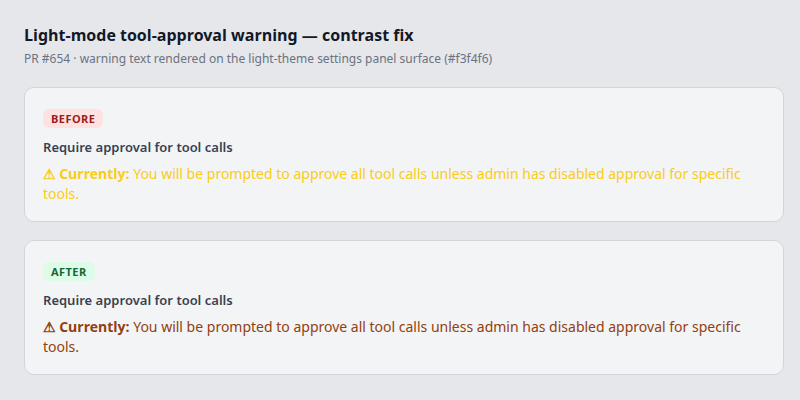

# Theme default and light-mode warning contrast (PR #654)

Date: 2026-06-14

## Summary

Two small, related UI changes:

1. **First-run default theme is now `dark`.** This is a deliberate product decision:
   Atlas does **not** follow the OS `prefers-color-scheme` setting for new users.
   Any explicit user choice already saved in `localStorage` (`atlas-theme` = `light`
   or `dark`) is always preserved.
2. **Higher-contrast tool-approval warning in light mode.** The "Currently: you will
   be prompted to approve all tool calls" warning previously used `text-yellow-400`,
   which is hard to read on the light-theme settings surface. It now uses a
   theme-aware `.approval-warning-text` class: `text-yellow-400` in dark mode,
   `text-amber-800` in light mode. The `⚠` warning glyph is retained.

## Implementation notes

- `frontend/src/contexts/ThemeContext.jsx` — `getInitialTheme()` returns `dark` when
  there is no stored preference. The previous `getSystemTheme()` helper and the
  `prefers-color-scheme` change listener were removed: the persistence effect writes
  `atlas-theme` on first mount, so the listener's "only follow system if unset" guard
  could never fire again — it was inert and contradicted the dark-default decision.
- `frontend/src/index.css` — adds `.approval-warning-text` and its
  `[data-theme="light"]` override.
- `frontend/src/components/SettingsPanel.jsx` — uses the new class.

## Visual evidence

Light-theme settings panel surface (`#f3f4f6`), before vs after:

## Tests

- `frontend/src/test/theme-context.test.jsx` — defaults to dark with no saved
  preference; preserves a saved `light` preference.
- `frontend/src/test/settings-panel-agent-mode.test.jsx` — asserts the warning uses
  the `.approval-warning-text` class.
