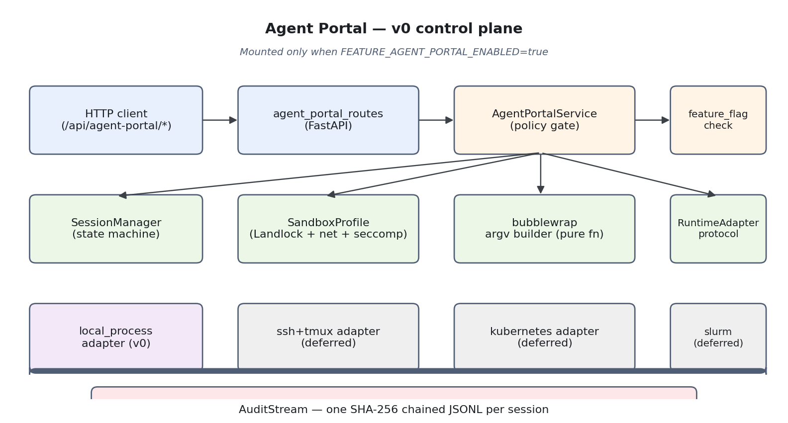
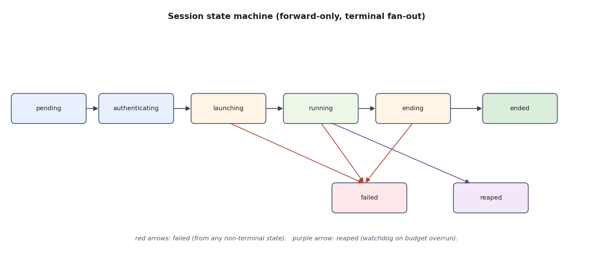
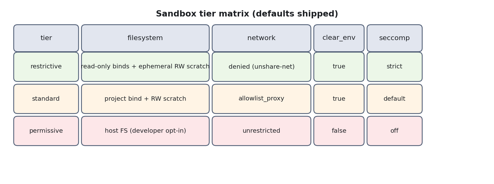
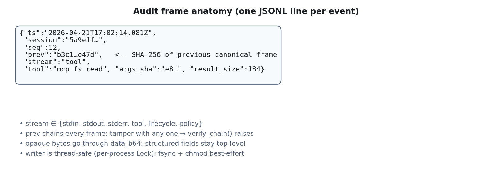
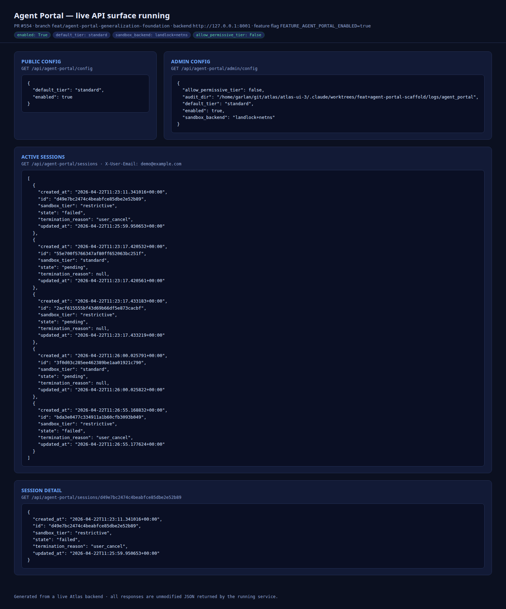
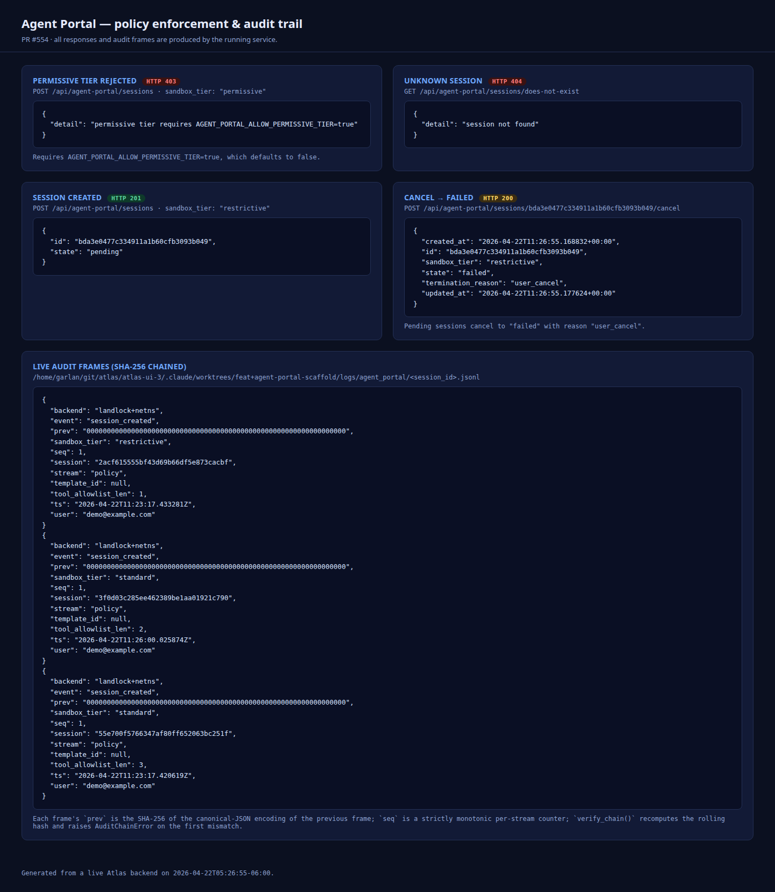

# Agent Portal (experimental)

Last updated: 2026-04-21
Feature flag: `FEATURE_AGENT_PORTAL_ENABLED` (default `false`)
Status: scaffolding / foundation only (PR #554). No UI or adapter-rich
behavior yet; this page documents what exists on `main` behind the flag
and how to configure it.

For design rationale and roadmap, see the design doc at
[`../planning/agent-portal-2026-04-20.md`](../planning/agent-portal-2026-04-20.md).

## 1. What the Agent Portal is for

Atlas is a chat surface with MCP tools and RAG. The Agent Portal
extends that with **governed, launchable agent sessions**: an admin
curates a launch template (scope, tools, budget, sandbox tier), a user
picks one, the portal materializes a sandboxed workspace, and an agent
runs to completion. Every decision and every byte is auditable.

Key product properties:

- **Governance at launch time.** Scope, tool allow-list, sandbox tier,
  and budget are resolved and baked into the launch command before the
  agent starts. The agent is never trusted to enforce its own limits.
- **Kernel-level isolation by default.** Agents run behind Landlock
  (filesystem) plus network restriction (namespace or filtered proxy)
  plus optional syscall filtering.
- **Runtime-agnostic control plane.** The portal speaks to a single
  `RuntimeAdapter` protocol. A `local_process` adapter ships first;
  `ssh_tmux`, `kubernetes`, and `slurm` adapters can be added without
  UX churn.
- **Audit as system of record.** A SHA-256 chained JSONL stream
  captures lifecycle events, stdin/stdout frames, and tool calls.
  Terminal scrollback is never the source of truth.

## 2. Architecture



The request path at a glance:

1. A client calls `/api/agent-portal/*`. Routes exist only when the
   feature flag is on.
2. `AgentPortalService` is the single policy gate: it checks the
   feature flag, validates the launch spec against the active sandbox
   tier policy, and refuses any request that would escape
   configuration (e.g. `permissive` tier without the explicit
   admin-only opt-in).
3. The service resolves a `SandboxProfile`, builds an argv via the
   pure-function bubblewrap command builder, and hands the pair off to
   a `RuntimeAdapter` (today: `local_process`).
4. Every state transition and every byte of stdin/stdout/tool I/O is
   appended to a per-session SHA-256-chained JSONL audit stream.

## 3. Session state machine



Transitions are linear-forward with two terminal fan-out paths:

- `failed` captures any error from non-terminal states; the audit tail
  is preserved and the session is frozen.
- `reaped` is set exclusively by the watchdog when a running session
  overruns its budget (wall-clock, tool-call count, or token ceiling).

`SessionManager` refuses any transition not listed on the diagram; the
state machine is the authoritative list of allowed edges.

## 4. Sandbox tiers



| Tier          | Intended for                                          | Network                   | Default FS policy                             | `permissive` opt-in required? |
|---------------|-------------------------------------------------------|---------------------------|-----------------------------------------------|-------------------------------|
| `restrictive` | Untrusted prompts, read-only analysis                 | `denied` (`--unshare-net`)| read-only binds + ephemeral RW scratch        | no                            |
| `standard`    | Normal dev work                                       | `allowlist_proxy`         | project bind + RW scratch                     | no                            |
| `permissive`  | Developer escape hatch                                | `unrestricted`            | host FS                                       | yes (`AGENT_PORTAL_ALLOW_PERMISSIVE_TIER=true`) |

The proxy referenced by `allowlist_proxy` is **not** shipped in this
PR — standard tier without an upstream filtering proxy degrades to
"proxy misconfigured" at launch time, which is intentional.

## 5. Audit stream



Each session owns one append-only JSONL file under
`${ATLAS_RUNTIME_DIR}/${AGENT_PORTAL_AUDIT_SUBDIR}/<session_uuid>.jsonl`.

Key properties:

- **Tamper-evident.** Every frame embeds `prev`, the SHA-256 of the
  canonical-JSON encoding of the previous frame. `verify_chain()`
  re-computes the rolling hash and raises `AuditChainError` on the
  first mismatch.
- **Monotonic.** A per-stream `seq` counter guarantees ordering
  independent of clock skew.
- **Opaque bytes.** stdin/stdout/stderr frames carry `data_b64`;
  structured fields (tool name, state transition, exit code) stay top
  level so external tailers can filter without decoding.
- **Owner-only on disk.** The writer best-effort `chmod`s the audit
  directory to `0o700` and each file to `0o600`. Audit integrity does
  not depend on mode bits — it depends on the hash chain — so
  filesystems that reject `chmod` do not break integrity.

## 6. Configuration

All settings are documented in `.env.example` and `docker-compose.yml`.
Defaults are safe: with no overrides, the feature is off and no routes
mount.

| Variable                              | Default               | Purpose                                                                                          |
|---------------------------------------|-----------------------|--------------------------------------------------------------------------------------------------|
| `FEATURE_AGENT_PORTAL_ENABLED`        | `false`               | Master switch. When false, `/api/agent-portal/*` is not registered and the service is a stub.    |
| `AGENT_PORTAL_DEFAULT_SANDBOX_TIER`   | `standard`            | Tier assigned when a launch spec omits `sandbox_tier`.                                           |
| `AGENT_PORTAL_ALLOW_PERMISSIVE_TIER`  | `false`               | Admin-only opt-in for the `permissive` tier. Without this, any launch requesting it is rejected. |
| `AGENT_PORTAL_SANDBOX_BACKEND`        | `landlock+netns`      | `landlock+netns`, `bubblewrap`, or `none` (developer escape hatch — requires the opt-in above).  |
| `AGENT_PORTAL_AUDIT_SUBDIR`           | `agent_portal/audit`  | Sub-directory under `ATLAS_RUNTIME_DIR` where per-session JSONL streams are written.             |

### Turning it on for a dev environment

```bash
# .env
FEATURE_AGENT_PORTAL_ENABLED=true
# Leave everything else at defaults. The standard tier will require an
# egress proxy in production, but policy checks can be exercised with
# no real agent command today.
```

```bash
curl -s -H 'X-User-Email: me@example.com' \
    http://127.0.0.1:8000/api/agent-portal/config | jq .
# { "enabled": true, "default_tier": "standard",
#   "allow_permissive_tier": false, "sandbox_backend": "landlock+netns" }
```

With the flag off the same request returns `404 Not Found` because the
route was never registered.

### Live API surface

The screenshots below are captured from a running backend with
`FEATURE_AGENT_PORTAL_ENABLED=true`. All JSON shown is produced by the
service itself; nothing is mocked or hand-edited.



The left column shows `GET /api/agent-portal/config` (the non-admin
summary) and `GET /api/agent-portal/admin/config` (the full effective
config, including `sandbox_backend` and the resolved on-disk
`audit_dir`). The wider panels show `GET /api/agent-portal/sessions`
for a user with a mix of `restrictive` and `standard` tier sessions,
including one that was cancelled and is now in the terminal `failed`
state with `termination_reason: "user_cancel"`.

### Policy enforcement and audit trail



This view exercises the service's negative paths and shows a tail of
the audit stream:

- Top-left: a launch with `sandbox_tier: "permissive"` is rejected with
  `HTTP 403` because `AGENT_PORTAL_ALLOW_PERMISSIVE_TIER` is `false`.
  The service refuses the request before any adapter is consulted.
- Top-right: `GET` on an unknown `session_id` returns `HTTP 404`.
- Middle: a valid `restrictive`-tier launch returns `HTTP 201` with
  the new session in the `pending` state.
- Middle-right: `POST /.../cancel` on that pending session drives it
  directly to the terminal `failed` state with
  `termination_reason: "user_cancel"` — a valid edge in the state
  machine (see §3).
- Bottom: three real audit frames, each with `prev` set to the
  all-zero genesis hash because each is the first frame of its own
  session's stream, a monotonic `seq`, and the structured fields
  (`event`, `sandbox_tier`, `tool_allowlist_len`, `user`, etc.) that
  external tailers can filter on without base64-decoding.

## 7. Testing

- `atlas/tests/test_agent_portal_*.py` — 36 unit tests covering
  profile defaults, bwrap argv construction, audit-chain verify and
  tamper detection, state-machine edges, feature-flag gating, and the
  permissive-tier opt-in.
- `test/pr-validation/test_pr554_agent_portal.sh` — end-to-end
  validation script that toggles the flag on and off via dedicated
  fixture envs and asserts route-mount behavior and the config
  endpoint payload.

Run them with:

```bash
# Unit tests (fast, no process launch)
cd atlas && PYTHONPATH="$(cd .. && pwd)" pytest tests/test_agent_portal_*.py

# PR validation script (feature-flag matrix)
bash test/run_pr_validation.sh 554
```

## 8. Not included in this PR

See §8 of the design doc for the full list. The short version:

- No SSH+tmux, Kubernetes, or SLURM adapter.
- No filtering egress proxy for `NetworkPolicy.allowlist_proxy`.
- No browser attach UI.
- No artifact packaging.
- No persistent session store across backend restarts.

## 9. Regenerating the diagrams

The PNG assets under `img/` are produced by a self-contained
`matplotlib` script. To refresh them:

```bash
python docs/features/img/generate_diagrams.py
```

The script has no network or browser dependency, so it works in CI and
in air-gapped environments.
