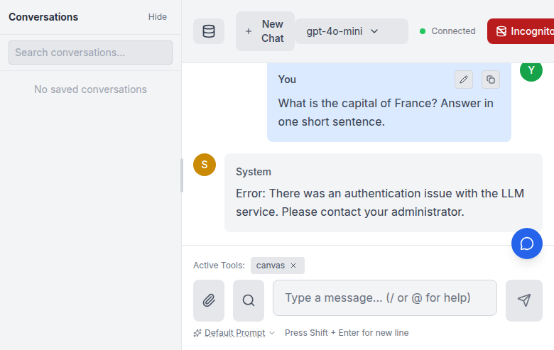
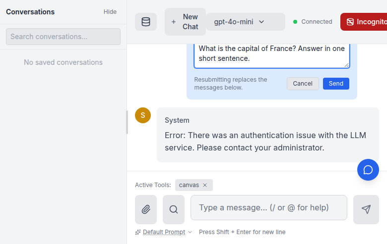

# Rewind / Edit a Previous Prompt (issue #142)

Users can go back to any earlier prompt in a conversation, optionally edit it,
and resubmit from that point. This is the chat equivalent of "rewind and start
again here": the targeted prompt and everything after it are dropped, and the
(edited) prompt is sent as a fresh turn.

The model is **overwrite-in-place** — the conversation stays a single linear
thread; the discarded continuation is not kept as a branch. (Last updated:
2026-06-14.)

## Using it

1. Hover over any of your own messages in the transcript. A subtle pencil icon
   appears next to the existing copy button (same hover treatment, so it stays
   out of the way until you want it).
2. Click the pencil. The message turns into an inline editor prefilled with the
   original text.
3. Edit if you like (or leave it unchanged to simply regenerate from that
   point), then **Send**. **Cancel** or **Esc** leaves the conversation
   untouched; **Enter** submits (**Shift+Enter** inserts a newline).

On submit, everything from that prompt onward is removed from view and the new
turn streams in its place. For server-saved conversations the persisted history
is rewritten to match (the save path is a full upsert, so the shortened thread
is what gets stored).

You cannot rewind while a response is still streaming — finish or stop the
current response first.

## Walkthrough

The screenshots below were captured against a live server (`atlas/main.py`)
driving the built frontend through a browser.

### 1. The edit affordance

Hovering a user message reveals a subtle pencil button beside the existing copy
button (both stay hidden until hover).

### 2. Inline editor

Clicking the pencil swaps the message for an inline editor prefilled with the
original text. A helper line spells out that resubmitting replaces the messages
below; **Send** resubmits, **Cancel** / **Esc** backs out.

## How it works

Messages are addressed by their **user-message ordinal** (the 0-based position
among `user` messages), not by absolute transcript position. The frontend
renders extra system/tool rows that have no backend counterpart, so counting
user messages is the one indexing scheme both sides agree on.

### Frontend

- `Message.jsx` renders the pencil affordance on user messages and the inline
  editor, calling `onRewind(userIndex, newContent)`.
- `ChatArea.jsx` computes each user message's ordinal while mapping the
  transcript and passes it down.
- `ChatContext.jsx` `rewindAndResubmit(userIndex, newContent)` truncates the
  local transcript at that prompt and calls `sendChatMessage`, which adds
  `rewind_to_user_index` to the `chat` WebSocket payload.

### Backend

- `ConversationHistory.truncate_at_user_index(user_index)`
  (`atlas/domain/messages/models.py`) drops the Nth user message and everything
  after it, returning the removed messages.
- `ChatOrchestrator.execute(..., rewind_to_user_index=...)`
  (`atlas/application/chat/orchestrator.py`) calls that truncation *before*
  appending the new prompt. An out-of-range or negative index is a no-op, so the
  turn simply appends as normal.
- `ChatRequest.rewind_to_user_index` (`atlas/domain/chat/dtos.py`) carries the
  field; `atlas/main.py` reads it off the `chat` message.

## Relationship to issue #622

The same rewind primitive is what issue #622 (opt-in capture + forced-tool DPO
replay) builds on: rewinding to a turn and replaying it with
`selected_tools=[X]` and `tool_choice_required=True`. `truncate_at_user_index`
deliberately **returns** the removed messages so a future capture layer can
record the discarded ("rejected") trajectory without any further plumbing.
Capture/consent itself is out of scope here.
