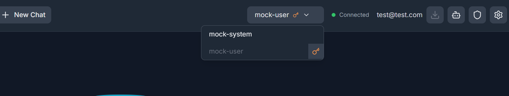
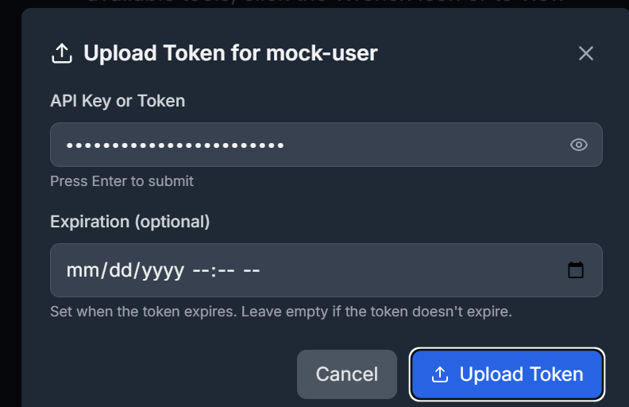
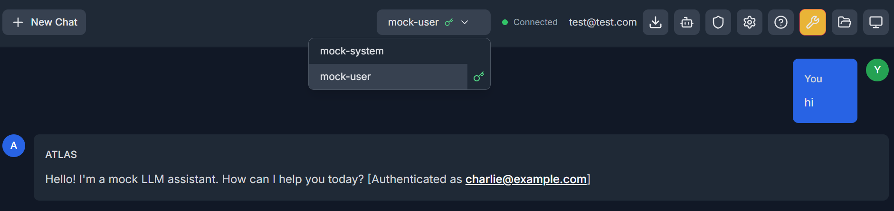

# Testing Per-User LLM API Keys with the Mock LLM

Last updated: 2026-02-10

## Overview

The mock LLM server (`mocks/llm-mock/main.py`) supports an optional auth mode
that validates Bearer tokens on every request and prints the authenticated key
to stdout. This lets you test the full per-user API key flow end-to-end without
needing a real LLM provider account.

## Quick Start

### 1. Start the mock LLM with auth enabled

```bash
cd mocks/llm-mock
MOCK_LLM_REQUIRE_AUTH=true python main.py
```

The server starts on `127.0.0.1:8002`. You will see auth logs in the terminal:

```
[AUTH] 2026-02-10T14:30:00 | Authenticated request with key: sk-t...st99
```

### 2. Configure llmconfig.yml

Create (or edit) `config/llmconfig.yml` with both a system-key model and a
user-key model pointing at the mock:

```yaml
models:
  # System-managed -- works immediately, no per-user setup needed
  mock-system:
    model_name: "openai/mock-model"
    model_url: "http://127.0.0.1:8002/v1"
    api_key: "mock-system-key"
    description: "Mock model with system-managed key"

  # User-managed -- each user must paste their own key via the UI
  mock-user:
    model_name: "openai/mock-model"
    model_url: "http://127.0.0.1:8002/v1"
    api_key: ""
    api_key_source: "user"
    description: "Mock model (bring your own key)"
```

### 3. Start the backend

```bash
bash agent_start.sh -b
```

### 4. Test in the browser

1. Open `http://localhost:8008` (or whichever port your `.env` uses).
2. In the model dropdown you should see:
   - **mock-system** -- selectable immediately.
   - **mock-user** -- shows an orange key icon (no key yet).

   

3. Click the key icon next to **mock-user**. Paste any string as the API key
   (e.g. `sk-charlie-test-key-003`). The icon turns green.

   

4. Select **mock-user** and send a chat message.
5. Check the mock LLM terminal -- you should see the `[AUTH]` line with the
   mapped user identity for the key you pasted.
6. The chat response will include `[Authenticated as user@example.com]`
   confirming the key reached the mock and was mapped to a user.

   

### 5. Verify key removal

1. Click the green key icon next to **mock-user** again and remove the key.
2. The icon turns orange and the model becomes unselectable.
3. Trying to chat with that model now fails with an auth-required error.

## How It Works

```
User pastes key in UI
    -> POST /api/llm/auth/{model}/token  (stored encrypted via MCPTokenStorage)
    -> User sends chat message
    -> LiteLLMCaller._get_model_kwargs sees api_key_source="user"
    -> Calls _resolve_user_api_key -> reads from token storage
    -> Passes key as api_key kwarg to LiteLLM
    -> LiteLLM sends Authorization: Bearer <key> to mock
    -> Mock validates, prints to stdout, includes in response
```

## Environment Variable

| Variable | Default | Description |
|----------|---------|-------------|
| `MOCK_LLM_REQUIRE_AUTH` | `false` | Set to `true` to require Bearer token on `/v1/chat/completions` |

When disabled (the default), the mock accepts all requests without auth,
preserving backward compatibility with existing tests.

## What to Look For

- **Mock LLM stdout**: `[AUTH]` lines confirm the per-user key arrived and map to a user.
- **Chat response text**: Contains `[Authenticated as user@example.com]` suffix.
- **Orange/green key icon**: Confirms frontend state management works.
- **Model disabled in dropdown**: Confirms UI blocks chat without a key.
- **No cross-user leakage**: If two browser tabs use different test users,
  each should see their own key in the mock logs.
