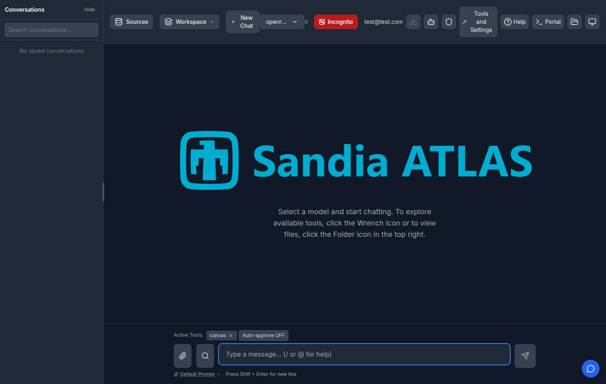
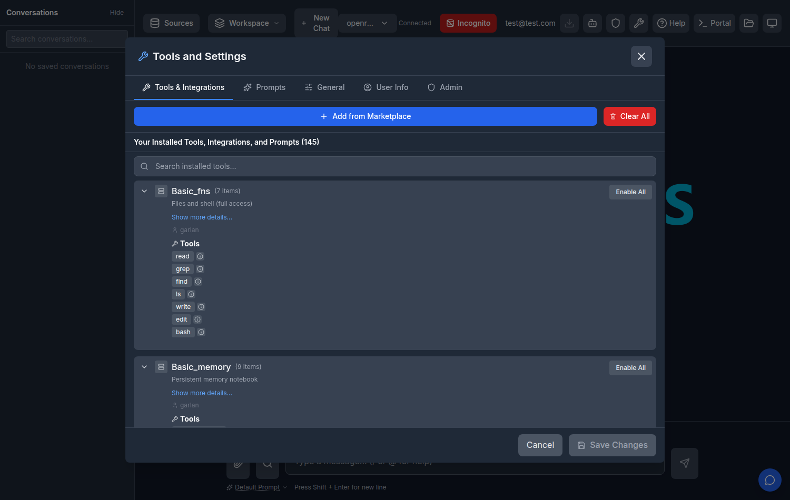
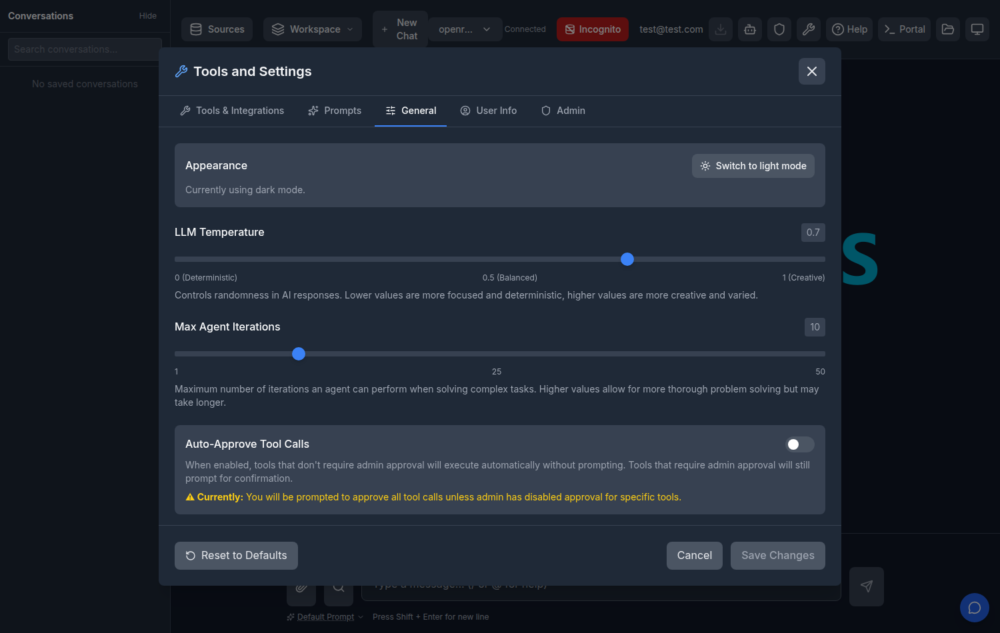
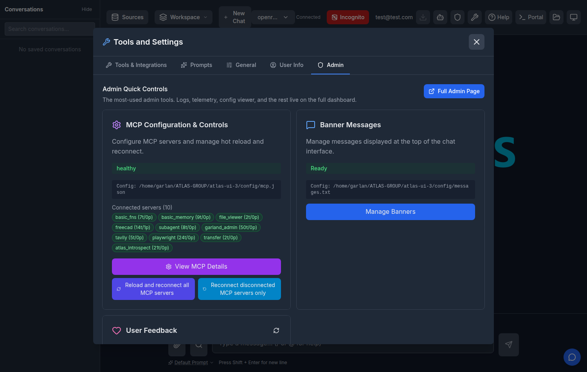
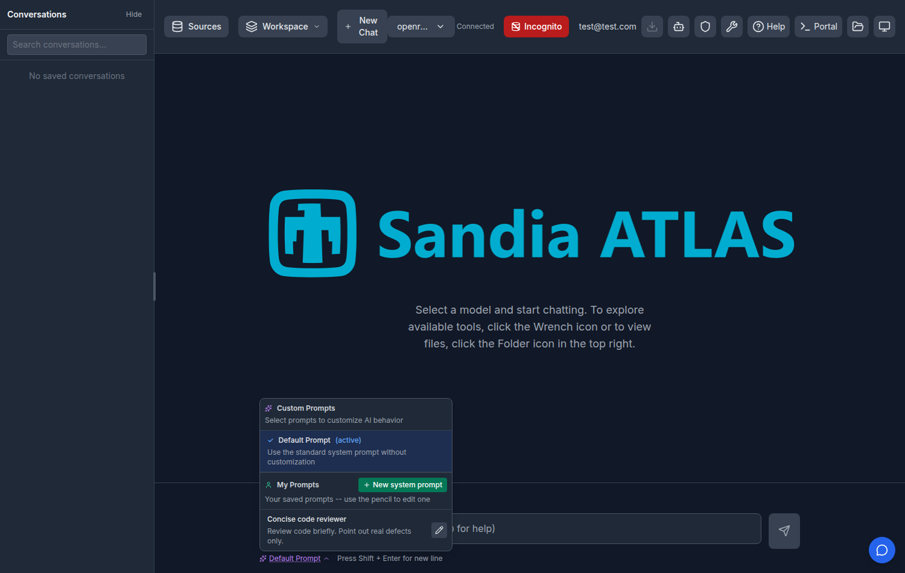
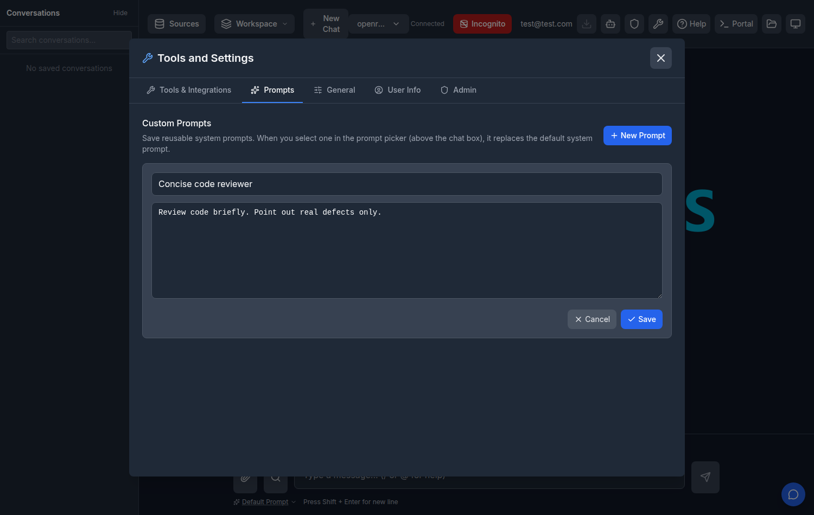

# Tools and Settings Panel (issue #836)

Last updated: 2026-08-24

The top bar used to carry three separate entry points -- a wrench for tools and
integrations, a gear for settings, and a sun/moon for the theme. They are now
one button, **Tools and Settings** (wrench icon), that opens a single tabbed
panel.

## Tabs

| Tab | What it holds | Shown when |
| --- | ------------- | ---------- |
| Tools & Integrations | The former tools panel: installed MCP servers, tool and prompt selection, marketplace link | `FEATURE_TOOLS_ENABLED` |
| Prompts | Your custom prompt library ([details](../custom-prompts/README.md)) | `FEATURE_CUSTOM_PROMPTS_ENABLED` |
| General | LLM temperature, agent iterations, tool approval, compact messages, debug, Globus, and the light/dark toggle | always |
| User Info | Reserved stub (issue #595) | always |
| Admin | The most-used admin controls, plus a link to the full dashboard | user is in an admin group |

The panel opens on **Tools & Integrations** when that feature is on, and
remembers the tab you were last on for the rest of the session.

Tool selections are still staged: change what is enabled, then **Save Changes**.
Switching tabs keeps pending selections, and closing the panel with unsaved
selections still raises the save/discard prompt.

## Light and dark mode

The theme toggle moved off the top bar into **General → Appearance**. The
choice is still saved per browser.

## Admin tab

Admins get the three most-used dashboard cards inline -- **MCP Configuration &
Controls**, **Banner Messages**, and **User Feedback** -- fully featured, not
read-only summaries. Everything else (logs, telemetry, config viewer, MCP
server manager, help content) stays on the full dashboard, one click away via
**Full Admin Page**.

## Finding your custom prompts quickly

The prompt picker under the chat input now has a **New system prompt** button
and a pencil next to each of your saved prompts.

Either one opens the Tools and Settings panel on the **Prompts** tab with the
editor already open on that prompt.

## How it works

| Layer | Component | Responsibility |
| ----- | --------- | -------------- |
| Shell | `App.jsx` | Owns panel open state, the tab to open on, and the prompt intent |
| Panel | `SettingsPanel` | Tab chrome; hosts the tools, prompts, general, user-info, and admin tabs |
| Tools | `ToolsPanel` (`embedded` prop) | Same component as before; renders bodyless-of-chrome inside the panel and stays mounted across tab switches |
| Admin | `admin/AdminQuickPanel` + `useAdminConfigActions` | The three cards, sharing notification/modal plumbing with `AdminDashboard` |
| Prompts | `PromptSelector` -> `utils/settingsPanelEvents` -> `PromptManager` | The picker asks for a tab and an edit/create intent via an `atlas:open-settings` window event |
