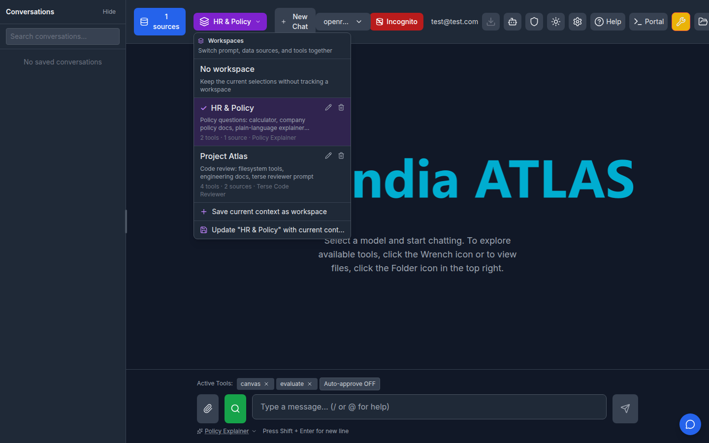
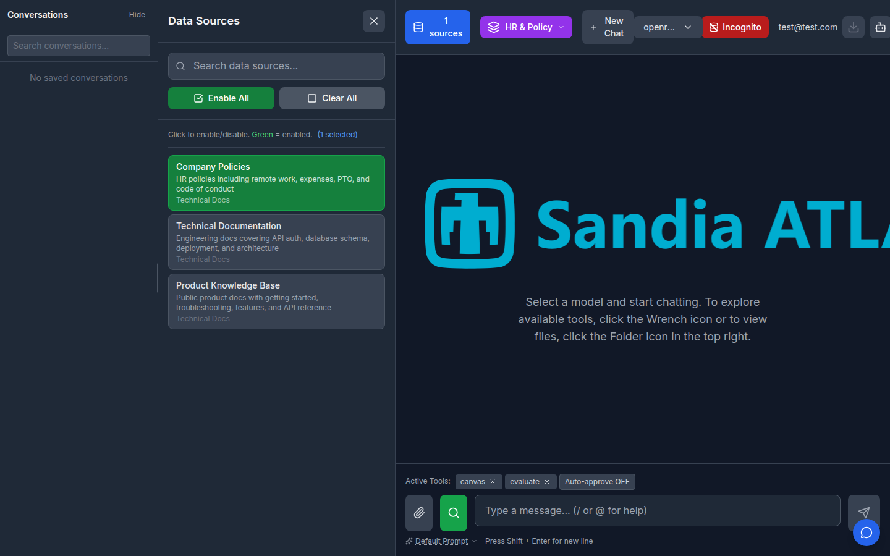
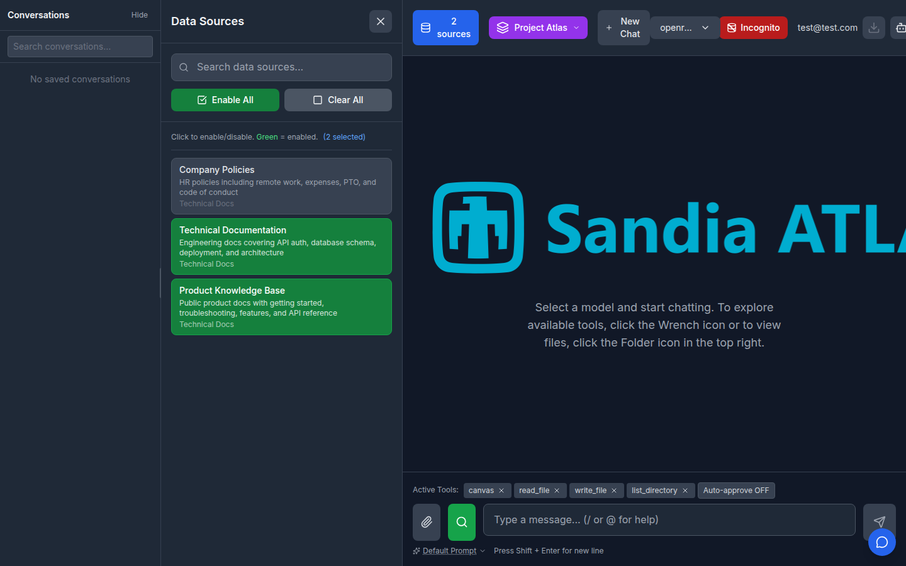
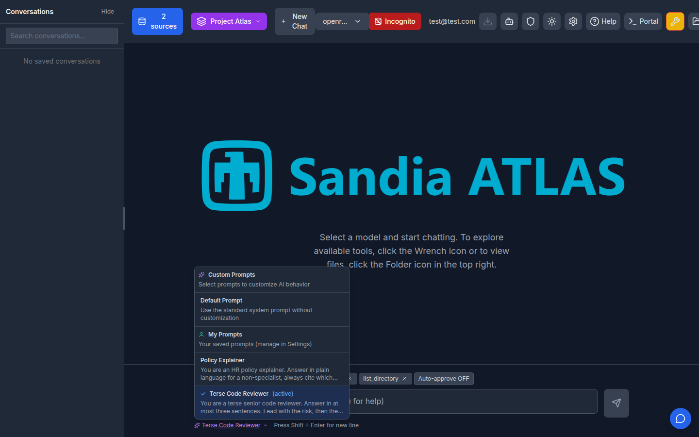
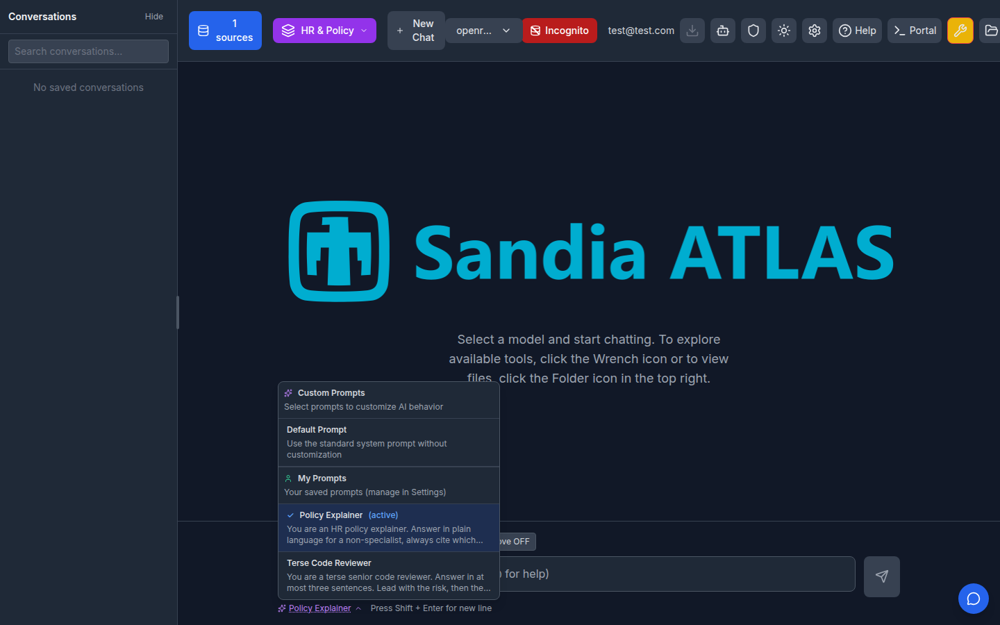
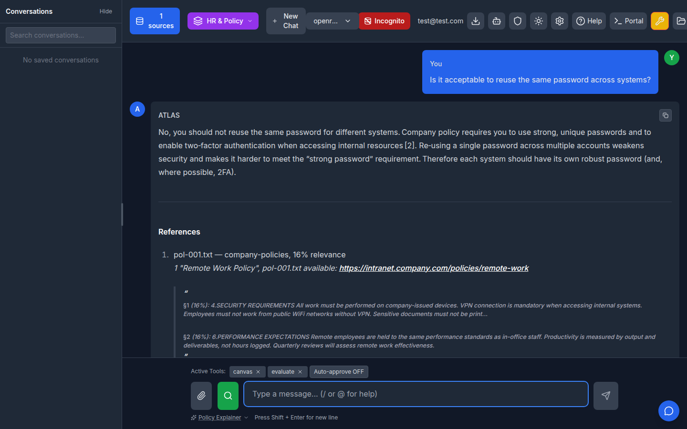
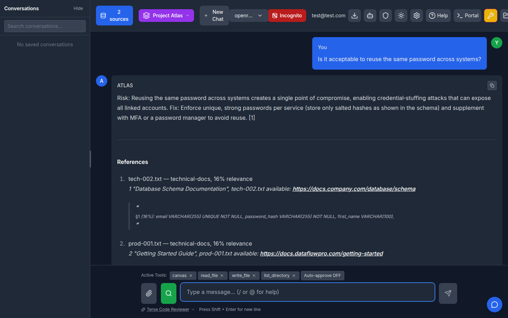
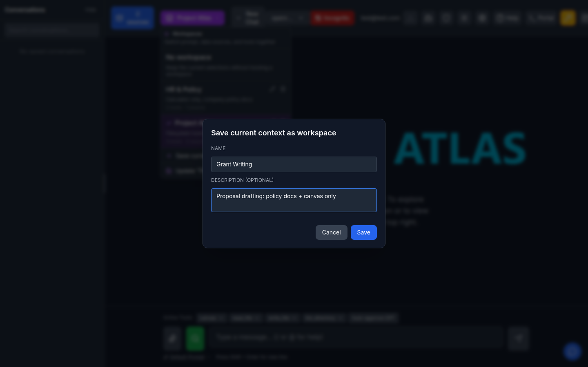
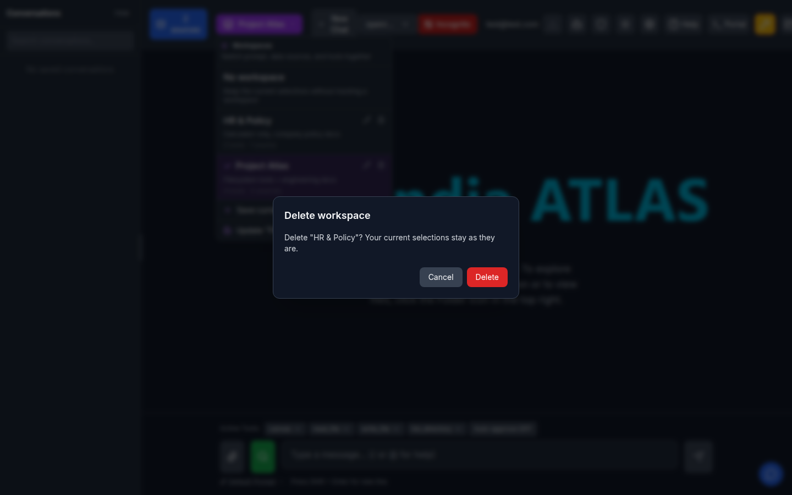
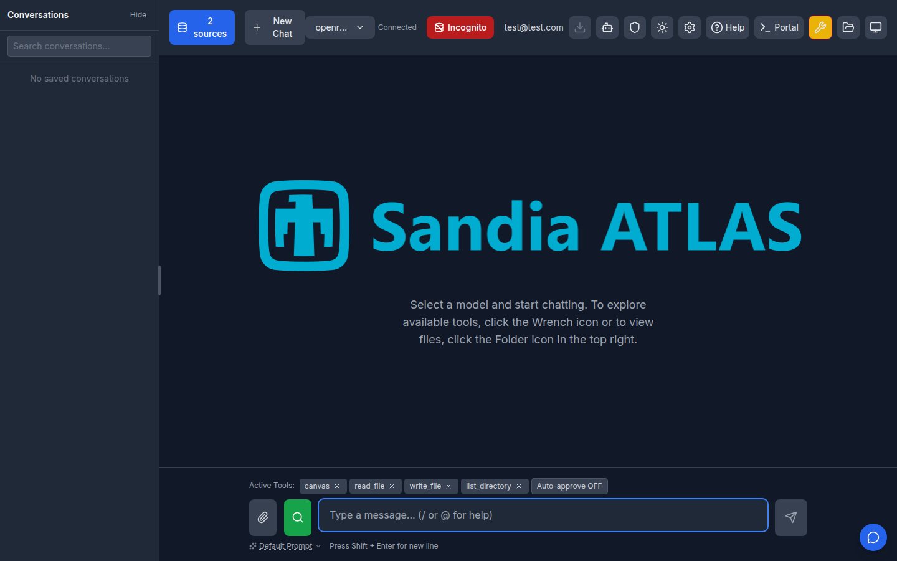

# Workspaces

A **workspace** is a named bundle of the selections that define your chat
context: **the active prompt**, the RAG data sources, and the MCP tools. Save
one per context — `Work`, `Home`, `Project A` — and switch between them in one
click instead of re-picking every selection by hand.

The prompt is a first-class part of a workspace, not an afterthought: switching
workspaces changes which system prompt the model actually runs under, alongside
the tools and sources.

Workspaces are stored per user in the chat-history database (DuckDB locally,
PostgreSQL in production) and exposed via `/api/workspaces`.

## Enabling it

```bash
FEATURE_WORKSPACES_ENABLED=true
FEATURE_CHAT_HISTORY_ENABLED=true   # required: workspaces live in that database
```

Both must be on. With chat history off there is nowhere to persist a workspace,
so the config payload reports `features.workspaces: false`, the switcher stays
hidden, and `/api/workspaces` returns 404 — the same "disabled features expose
no surface" rule the custom prompt library follows.

## Using it

The **Workspace** button sits in the header next to *New Chat* (it turns purple
and shows the name while a workspace is active).



Each row shows the workspace name, its description, and a summary of what it
holds — including **which prompt** it carries, by name
(`4 tools · 2 sources · Terse Code Reviewer`) — with rename and delete actions.

1. Select the prompt, data sources, and tools you want, the way you normally
   would.
2. Open the workspace dropdown → **Save current context as workspace**, give it
   a name and an optional description.
3. Switch contexts later by picking a workspace from the same dropdown.
4. **Update "<name>" with current context** overwrites a saved workspace with
   whatever is currently selected. **Rename** and **Delete** are per-row.
5. **No workspace** stops tracking one; your current selections stay as they
   are.

Applying a workspace **replaces** the current selections rather than merging
into them — carrying leftovers over from the previous context would silently
widen which tools and data sources a chat can reach. One click swaps the whole
context; below, the same session under `HR & Policy` and then `Project Atlas`:





Note what changed: the data sources (`Company Policies` alone versus
`Technical Documentation` + `Product Knowledge Base`) and the active tools
(`canvas`, `evaluate` versus `canvas`, `read_file`, `write_file`,
`list_directory`). Nothing leaks across.

### The prompt switches too

The active prompt travels with the workspace. Under `Project Atlas` the prompt
picker shows **Terse Code Reviewer** as active; under `HR & Policy`, **Policy
Explainer**:





That is not just a label — it is the system prompt the model runs under. The
same question asked in each workspace comes back in the voice each prompt asks
for, against that workspace's own corpus:





`HR & Policy` answers in plain language and cites `pol-001.txt` from
`company-policies`; `Project Atlas` answers `Risk: … Fix: …` in two sentences
and cites `tech-002.txt` from `technical-docs`.

Both kinds of prompt are covered. A user-authored prompt from the custom prompt
library is stored as `userprompt:<id>` and **replaces** the system prompt; an
MCP server prompt is stored under its `<server>_<name>` key and is loaded into
`selected_prompts` so it is prepended, exactly as the prompt picker does
outside a workspace.

Saving prompts for a name and an optional description, and deleting asks for
confirmation:





With the feature disabled the header carries no workspace button at all:



## What a workspace stores

```json
{
  "active_prompt_key": "userprompt:<id> | <mcp-server>_<prompt> | null",
  "selected_tools": ["<server>_<tool>", "..."],
  "selected_prompts": ["<server>_<prompt>", "..."],
  "selected_data_sources": ["<rag-source>", "..."],
  "rag_enabled": true
}
```

The config is a **closed shape**: the API rejects unknown keys (422) and the
repository normalizes values on the way in (deduped, trimmed, capped at 500
entries of at most 300 characters). Adding a new selection dimension is a
deliberate change to `WorkspaceConfig` in `atlas/routes/workspace_routes.py`
and `normalize_config` in
`atlas/modules/chat_history/workspace_repository.py`.

A workspace stores *keys*, not permissions. Switching to one selects tools and
sources you are already authorized for; it never grants access, and a key that
no longer exists is simply inert.

## API

| Method | Path | Notes |
| --- | --- | --- |
| `GET` | `/api/workspaces` | List your workspaces, most recently updated first |
| `POST` | `/api/workspaces` | `{name, description?, config?}` |
| `PUT` | `/api/workspaces/{id}` | Any of `name`, `description`, `config`; `config` is replaced wholesale, never merged |
| `DELETE` | `/api/workspaces/{id}` | |

Every query is scoped to the authenticated user, so another user's id returns
404 rather than their data.

## Where the code lives

| Layer | File |
| --- | --- |
| Table | `atlas/modules/chat_history/models.py` (`UserWorkspaceRecord`), migration `alembic/versions/003_add_user_workspaces.py` |
| Persistence | `atlas/modules/chat_history/workspace_repository.py` |
| REST | `atlas/routes/workspace_routes.py` |
| Gate | `AppSettings.workspaces_effective` in `atlas/modules/config/settings.py` |
| Selection snapshot/apply | `frontend/src/hooks/chat/useSelections.js` |
| CRUD hook | `frontend/src/hooks/useWorkspaces.js` |
| UI | `frontend/src/components/WorkspaceSelector.jsx` (rendered from `Header.jsx`) |
